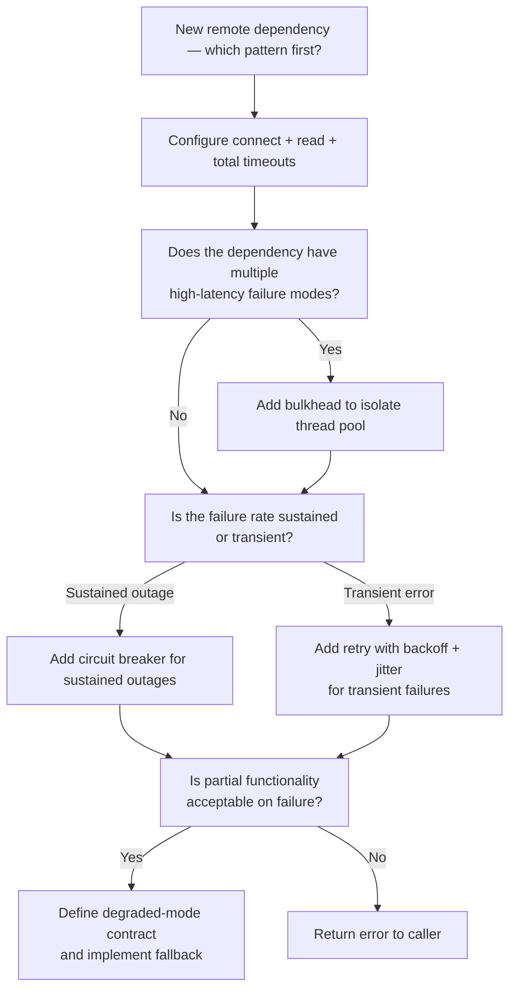

# Resilience Patterns

> Keeping distributed systems alive when the dependencies they depend on are not

---

## Learning Objectives

By the end of this topic you will be able to:

- Trace a circuit breaker through CLOSED, OPEN, and HALF_OPEN states and explain what event triggers each transition
- Explain how bulkhead isolation prevents a slow downstream dependency from exhausting the entire thread pool of a calling service
- Derive a retry budget given an SLA deadline, a per-attempt timeout, and a maximum retry count
- Apply jitter to an exponential backoff formula and explain why it prevents the thundering herd
- Design a timeout hierarchy (connect, read, total) and explain how deadline propagation prevents unbounded wait chains
- Identify which resilience pattern to apply first given a specific failure scenario

---

## ELI5: Explain Like I'm 5

<div class="learner-section" markdown>

**Your task:** After studying the patterns, explain each one in plain English.

**Prompts to guide you:**

1. **What problem do resilience patterns solve?**
    - Your answer: <span class="fill-in">Without resilience patterns, one failing service can ___, which causes ___ to cascade through ___</span>

2. **Circuit breaker analogy:**
    - Example: "A circuit breaker is like the fuse box in your house — when too much current flows, the breaker trips and cuts the circuit before the wiring catches fire."
    - Your analogy: <span class="fill-in">A circuit breaker in software is like ___ because ___</span>

3. **Bulkhead analogy:**
    - Example: "Bulkheads in a ship divide the hull into watertight compartments so that one hole doesn't sink the whole vessel."
    - Your analogy: <span class="fill-in">A bulkhead in software is like ___ because ___</span>

4. **Retry with jitter in one sentence:**
    - Your answer: <span class="fill-in">Jitter solves the thundering herd by ___, which prevents ___</span>

5. **Timeout hierarchy in one sentence:**
    - Your answer: <span class="fill-in">A timeout hierarchy matters because without it, a single slow dependency can ___</span>

6. **Graceful degradation in one sentence:**
    - Your answer: <span class="fill-in">Graceful degradation means returning ___ instead of ___ so that users still ___</span>

</div>

---

## Quick Quiz (Do BEFORE studying the patterns)

!!! tip "How to use this section"
    Answer these from your current intuition now. Return here after studying each pattern and fill in the verified answers.

<div class="learner-section" markdown>

**Your task:** Test your intuition before reading further.

### State Machine Predictions

1. **Circuit breaker starts CLOSED. After 5 consecutive failures, it opens. What happens to the 6th request?**
    - Your guess: <span class="fill-in">[Forwarded to downstream / Rejected immediately / Queued]</span>
    - Verified after studying: <span class="fill-in">[Fill in]</span>

2. **After the recovery timeout expires, the circuit enters HALF_OPEN. One request is allowed through and succeeds. What state does the circuit enter next?**
    - Your guess: <span class="fill-in">[CLOSED / OPEN / stays HALF_OPEN]</span>
    - Verified: <span class="fill-in">[Fill in]</span>

3. **After the recovery timeout expires, the circuit enters HALF_OPEN. The probe request fails. What happens?**
    - Your guess: <span class="fill-in">[Fill in]</span>
    - Verified: <span class="fill-in">[Fill in]</span>

### Retry Budget Predictions

**Service SLA: 2 000 ms. Per-attempt timeout: 400 ms. Max retries: 3.**

4. **Total time consumed if all attempts timeout:**
    - Your calculation: <span class="fill-in">[Fill in]</span>
    - Does it fit inside the SLA? <span class="fill-in">[Yes / No]</span>
    - Verified: <span class="fill-in">[Fill in]</span>

5. **You increase max retries to 5. Does the retry chain still fit in the SLA?**
    - Your calculation: <span class="fill-in">[5 × 400 ms = ?]</span>
    - Verified: <span class="fill-in">[Fill in]</span>

### Scenario Predictions

**Scenario 1:** Payment gateway starts timing out for 60 seconds. Your checkout service has no circuit breaker. What happens to checkout threads over those 60 seconds?

- Your answer: <span class="fill-in">[Fill in]</span>
- Verified after studying: <span class="fill-in">[Fill in]</span>

**Scenario 2:** 500 services all restart simultaneously after an outage and immediately retry failed requests. No jitter. What problem emerges?

- Your answer: <span class="fill-in">[Fill in]</span>
- Verified: <span class="fill-in">[Fill in]</span>

**Scenario 3:** A service calls a payment gateway and an inventory service. The payment gateway pool and the inventory pool are combined. The inventory service goes down. Predict what happens to payment gateway calls.

- Your answer: <span class="fill-in">[Fill in]</span>
- Verified after studying bulkhead: <span class="fill-in">[Fill in]</span>

**Scenario 4:** A service has a 1 s connect timeout, a 5 s read timeout, and allows 3 retries. The upstream caller has a 4 s SLA. Calculate the maximum possible latency seen by the upstream caller if all retries exhaust the read timeout.

- Your calculation: <span class="fill-in">[3 × (1 s + 5 s) = ?]</span>
- Does this fit the upstream SLA? <span class="fill-in">[Yes / No]</span>
- Verified: <span class="fill-in">[Fill in]</span>

</div>

---

## Pattern 1: Circuit Breaker

### Concept

A circuit breaker wraps calls to a remote dependency and tracks failure outcomes. When failures exceed a threshold, the breaker opens and rejects subsequent calls immediately — without waiting for a network timeout. After a configured recovery timeout, it enters a half-open probe state and allows one trial request through. A successful probe closes the circuit; a failed probe reopens it and resets the timeout.

**State machine:**

```
CLOSED ──(failure threshold exceeded)──► OPEN
  ▲                                        │
  │                                        │ (recovery timeout expires)
  │                                        ▼
  └──────(probe succeeds)────────── HALF_OPEN
                                          │
                               (probe fails)
                                          │
                                          ▼
                                        OPEN (reset timer)
```

| State | Behaviour | Transitions out |
|-------|-----------|-----------------|
| CLOSED | All calls forwarded to downstream | → OPEN when failure count ≥ threshold |
| OPEN | All calls rejected immediately (fast-fail) | → HALF_OPEN when recovery timeout expires |
| HALF_OPEN | One probe call allowed through | → CLOSED on success; → OPEN on failure |

**Why fast-fail matters:** A thread blocked on a 30-second TCP timeout holds a connection, a thread-pool slot, and any upstream resources waiting for it. Multiplied across hundreds of concurrent requests, a single slow dependency can exhaust the entire thread pool of the caller. A circuit breaker converts a 30-second stall into a sub-millisecond rejection, preserving capacity for requests that can succeed.

**Tuning thresholds:**

- Failure threshold too low: spurious opens on transient errors, causing unnecessary degradation
- Failure threshold too high: slow to protect; many requests waste time before the breaker opens
- Recovery timeout too short: the circuit oscillates — opens, probes, fails, reopens in rapid succession
- Recovery timeout too long: the service stays dark long after the dependency recovers

A common starting point is 5 failures within a 10-second window, with a 30-second recovery timeout. Tune based on observed p99 latency of the dependency and acceptable degradation duration.

### Java Implementation Stub

```java
import java.util.concurrent.atomic.AtomicInteger;
import java.util.concurrent.atomic.AtomicLong;
import java.util.concurrent.atomic.AtomicReference;
import java.util.function.Supplier;

/**
 * Circuit Breaker — wraps calls to a remote dependency and trips open
 * when failures exceed a threshold.
 *
 * States:
 *   CLOSED    — normal operation; all calls forwarded
 *   OPEN      — fast-fail; all calls rejected immediately
 *   HALF_OPEN — one probe request allowed through to test recovery
 */
public class CircuitBreaker {

    public enum State { CLOSED, OPEN, HALF_OPEN }

    private final int failureThreshold;        // failures before opening
    private final long recoveryTimeoutMs;      // ms to wait before probing

    private final AtomicReference<State> state;
    private final AtomicInteger failureCount;
    private final AtomicLong lastFailureTime;  // epoch ms of most recent failure

    /**
     * @param failureThreshold  consecutive failures that trip the breaker open
     * @param recoveryTimeoutMs milliseconds to wait in OPEN before entering HALF_OPEN
     */
    public CircuitBreaker(int failureThreshold, long recoveryTimeoutMs) {
        this.failureThreshold = failureThreshold;
        this.recoveryTimeoutMs = recoveryTimeoutMs;
        // TODO: initialise state to CLOSED
        // TODO: initialise failureCount to 0
        // TODO: initialise lastFailureTime to 0
        this.state = null; // replace
        this.failureCount = null; // replace
        this.lastFailureTime = null; // replace
    }

    /**
     * Execute the given supplier if the circuit allows it.
     *
     * @param action the remote call to attempt
     * @param <T>    return type
     * @return result of action
     * @throws CircuitOpenException if the circuit is OPEN and the recovery timeout has not elapsed
     *
     * TODO: implement the execution guard
     * 1. Call getState() to get the current (possibly auto-transitioning) state
     * 2. If OPEN, throw CircuitOpenException
     * 3. If HALF_OPEN, allow the call through; on success call recordSuccess();
     *    on failure call recordFailure() and re-throw
     * 4. If CLOSED, allow the call through; on success call recordSuccess();
     *    on failure call recordFailure() and re-throw
     */
    public <T> T execute(Supplier<T> action) {
        // TODO: implement
        throw new UnsupportedOperationException("TODO");
    }

    /**
     * Record a successful downstream call.
     *
     * TODO: implement
     * - If state is HALF_OPEN, transition to CLOSED and reset failureCount
     * - If state is CLOSED, reset failureCount (success clears the failure streak)
     */
    public void recordSuccess() {
        // TODO: implement
    }

    /**
     * Record a failed downstream call.
     *
     * TODO: implement
     * - Increment failureCount
     * - Record lastFailureTime = System.currentTimeMillis()
     * - If failureCount >= failureThreshold, transition state to OPEN
     */
    public void recordFailure() {
        // TODO: implement
    }

    /**
     * Return the current logical state, auto-transitioning OPEN → HALF_OPEN
     * when the recovery timeout has elapsed.
     *
     * TODO: implement
     * - If current state is OPEN and (now - lastFailureTime) >= recoveryTimeoutMs,
     *   transition to HALF_OPEN (use compareAndSet to avoid races)
     * - Return the current state
     */
    public State getState() {
        // TODO: implement
        return state.get(); // replace with correct logic
    }

    /** Thrown when a call is rejected because the circuit is open. */
    public static class CircuitOpenException extends RuntimeException {
        public CircuitOpenException(String message) {
            super(message);
        }
    }
}
```

!!! warning "Failure counting strategy matters"
    The stub above counts consecutive failures. Production circuit breakers (Resilience4j, Hystrix) typically use a sliding-window count or rate: "≥ 50% failure rate in the last 10 calls." Consecutive counting is simpler but overly sensitive to a single transient spike. When tuning, consider whether a momentary blip or a sustained degradation should open the circuit.

---

## Pattern 2: Bulkhead

### Concept

A bulkhead isolates thread pool or semaphore capacity by dependency so that saturation in one pool cannot consume resources intended for another. Without isolation, every downstream service shares the same thread pool. A single slow dependency holding 200 threads leaves none for the payment service, the inventory service, or health-check endpoints.

**Two implementation approaches:**

| Approach | Mechanism | Overhead | Use when |
|----------|-----------|----------|----------|
| Thread pool isolation | Separate executor per dependency | Higher (context switch per call) | Calls involve blocking I/O; pool size directly limits concurrency |
| Semaphore isolation | Counted semaphore on the calling thread | Lower (no extra thread) | Calls are fast or non-blocking; thread overhead is unacceptable |

**Sizing thread pool bulkheads:**

```
pool_size = (requests_per_second × p99_latency_seconds) + small_headroom
```

Example: 200 req/s to a payment service with 150 ms p99 latency:

```
pool_size = 200 × 0.15 + 10 = 40 threads
```

Undersizing causes unnecessary rejections; oversizing wastes memory and defeats isolation. Start with Little's Law and adjust based on observed queue depth.

**What bulkheads do NOT solve:** Bulkheads limit the blast radius of a slow dependency but do not make that dependency faster. Pair bulkheads with circuit breakers: the circuit breaker detects the failure and fast-fails requests; the bulkhead limits how many threads were consumed before the breaker opened.

**When bulkheads add overhead without value:**

- Services with a single downstream dependency — there is nothing else to isolate from
- Extremely low-latency calls (sub-millisecond in-process) where thread overhead exceeds call cost
- Read-only caches that return immediately — the latency profile does not threaten saturation

---

## Pattern 3: Retry with Exponential Backoff

### Concept

Retries recover from transient failures — a momentary network blip, a brief GC pause on a downstream server, a 503 from a rolling deployment. Without retries, these recoverable errors surface as permanent failures to callers.

**Exponential backoff formula:**

```
wait = base_delay × (2 ^ attempt_number)
```

Example with `base_delay = 100 ms`:

| Attempt | Wait before retry |
|---------|------------------|
| 1 | 100 ms |
| 2 | 200 ms |
| 3 | 400 ms |
| 4 | 800 ms |

**The thundering herd problem:** If 500 instances all fail at the same time and retry on the same schedule, they create coordinated bursts that repeatedly hammer the recovering dependency — often knocking it down again before it can stabilise.

**Jitter breaks the synchrony.** Full jitter replaces the deterministic wait with a uniform random value in `[0, computed_backoff]`:

```
wait = random_uniform(0, base_delay × 2^attempt)
```

This spreads retries across the full backoff window, converting a sharp spike into a smooth ramp.

**Retry budget — the critical constraint:**

Every retry attempt consumes time. The retry chain must fit inside the caller's SLA budget:

```
total_budget = max_attempts × per_attempt_timeout + overhead
```

If the SLA budget is 2 000 ms, the per-attempt timeout is 400 ms, and max retries is 3:

```
3 × 400 ms = 1 200 ms  →  fits within 2 000 ms SLA
```

With 5 retries:

```
5 × 400 ms = 2 000 ms  →  leaves no margin for network overhead or caller processing
```

**What should be retried:**

- Transient errors: network timeouts, 503 Service Unavailable, 429 Too Many Requests (with Retry-After)
- Not retried: 400 Bad Request (client bug), 401/403 (auth failure), 404 Not Found, or any mutation that is not idempotent

!!! warning "Non-idempotent mutations must not be retried blindly"
    Retrying a `POST /orders` that timed out can create duplicate orders. Either make the operation idempotent (idempotency key in the request), use exactly-once semantics at the infrastructure layer, or limit retries to read operations and idempotent writes.

---

## Pattern 4: Timeout Hierarchy

### Concept

A timeout hierarchy defines three distinct timeout layers for every remote call, and enforces that the outermost deadline bounds all inner timeouts.

| Timeout type | What it bounds | Typical values |
|--------------|----------------|----------------|
| Connect timeout | Time to establish a TCP connection | 1–3 s |
| Read timeout | Time to receive the next byte after the connection is established | Dependent on p99 of the dependency |
| Total timeout (deadline) | End-to-end wall-clock budget including retries | Derived from caller's SLA |

**Why each layer matters:**

- Connect timeout without read timeout: the connection establishes quickly, but the server hangs mid-response and the caller waits forever.
- Read timeout without connect timeout: a network partition causes the TCP SYN to hang for the kernel's default timeout (90 seconds on Linux), which is usually far too long.
- Both fine-grained timeouts without a total deadline: three retries × 5 s read timeout = 15 s, far exceeding a 2 s SLA.

**Deadline propagation:** In a chain `A → B → C`, service A has a 2 000 ms SLA. It calls B with a deadline of 1 800 ms (leaving headroom). B propagates a shorter deadline to C. This prevents C from doing expensive work for a request that A has already given up on.

Propagate deadlines via HTTP headers (`Grpc-Timeout`, custom `X-Request-Deadline`) or RPC metadata. At each hop, subtract elapsed time from the remaining deadline before forwarding. Reject requests that arrive with an already-expired deadline.

**The missing timeout anti-pattern:** Many HTTP client libraries ship with no timeout by default (Java's `HttpURLConnection`, older OkHttp configurations). In a microservices graph, one unconfigured client can hold a thread indefinitely, causing the bulkhead to fill and the circuit breaker to never get a chance to open.

---

## Pattern 5: Graceful Degradation

### Concept

Graceful degradation returns a reduced but functional response when a dependency is unavailable, rather than propagating an error to the user. The service continues operating at a lower fidelity — the degraded-mode contract — instead of failing completely.

**Degradation strategies:**

| Strategy | Description | Example |
|----------|-------------|---------|
| Cached fallback | Return the last known-good response | Serve yesterday's product catalogue from cache |
| Default / empty response | Return a safe default | Return empty recommendations list instead of error |
| Feature flag disable | Turn off the feature entirely | Hide "Recommended for you" widget |
| Static asset fallback | Serve a pre-rendered page | Serve a static maintenance banner |

**Designing a degraded-mode contract:** A degraded-mode contract specifies exactly what data the service will return when a dependency is down. It must be agreed between the service and its callers before the outage, not improvised during one. Key questions:

- Is the fallback data stale-safe? (Prices that are hours old may be wrong; product descriptions usually are not.)
- Does the fallback create downstream inconsistency? (Showing a product as "in stock" from cache when inventory is actually zero causes overselling.)
- How does the service signal to callers that it is in degraded mode? (HTTP header, response envelope field, metric label.)

**Feature flags as a manual circuit breaker:** A feature flag on the dependency call lets operators disable a non-critical integration instantly — without a deployment. Pair flags with circuit breakers: the circuit breaker auto-degrades; the flag allows manual override for planned maintenance or prolonged outages.

**Degradation is not free:** A service that falls back to a stale cache must invalidate that cache when the dependency recovers. A service that hides a feature must restore it. Degradation adds operational surface area. Reserve it for features where a degraded experience is genuinely better than an error — and document the recovery procedure.

---

## Common Misconceptions

!!! warning "A circuit breaker is a retry mechanism"
    A circuit breaker does the opposite of retrying. Its purpose is to stop sending requests to a failing dependency immediately, rather than letting every request block for a full timeout. Retries and circuit breakers are complementary: retries handle transient single-request failures; the circuit breaker handles sustained dependency outages. Never put retries inside the `execute()` call of a circuit breaker — if the retried call also fails, it increments the failure counter multiple times per original request, tripping the breaker prematurely.

!!! warning "Adding retries always improves reliability"
    Retries improve reliability only for idempotent operations against transient failures. For a non-idempotent mutation, a retry can create duplicate side effects. For a dependency that is overloaded rather than temporarily unavailable, retries amplify load — a service responding with 503 under 100% load will receive 300 requests if every caller retries twice, driving it further into failure. Always pair retries with a circuit breaker; once the breaker opens, retries stop.

!!! warning "Bulkheads require separate microservices"
    Bulkheads are a thread pool or semaphore pattern within a single service, not an architectural decomposition. A monolith that calls three external APIs can have three separate `ExecutorService` instances — one per API — without splitting into microservices. The isolation is achieved in code, not in deployment topology.

!!! warning "Graceful degradation means ignoring errors silently"
    Degradation is a contract, not a cover-up. The service must signal to its callers that it is operating in degraded mode (via response headers, envelope fields, or metrics). Silent swallowing of errors hides outages from operators and leaves callers unaware that the data they received is stale or incomplete. Always make degradation observable.

!!! warning "Timeouts guarantee that the downstream call stops"
    A read timeout on the client side tells the client to stop waiting, but it does not cancel the in-flight request on the server. The downstream service may continue executing, consuming CPU, locks, and database connections, even after the caller has abandoned the request. True cancellation requires cooperative support: context propagation (Go `context.Context`, gRPC cancellation) or server-side deadlines. Without it, "timeout" means "caller gave up" — not "work stopped."

---

## Before/After: Cascade Failure Without Patterns

**Scenario:** A product page service calls a recommendation engine. The recommendation engine develops a memory leak and its p99 latency climbs from 50 ms to 8 000 ms over 10 minutes.

### Without resilience patterns

```
Product page service — 200 thread pool
├── Thread 1: waiting on recommendation engine (8 000 ms)
├── Thread 2: waiting on recommendation engine (8 000 ms)
├── ...
├── Thread 200: waiting on recommendation engine (8 000 ms)
└── Thread 201 (incoming): rejected — pool exhausted → HTTP 503
```

After ~10 seconds at normal traffic (200 req/s × 8 s per request = 1 600 threads needed, but only 200 available), the product page service returns 503 to all users — even those who do not use recommendations.

### With timeout + circuit breaker + bulkhead + graceful degradation

```
Product page service
├── Recommendation bulkhead pool (20 threads, isolated)
│   ├── Thread 1: waiting, hits 500 ms read timeout → failure
│   ├── Thread 2: waiting, hits 500 ms read timeout → failure
│   ├── ... (5 failures within 10 s → circuit OPENS)
│   └── Thread 6+: circuit open → immediate rejection (< 1 ms)
├── Main pool (180 threads, unaffected)
│   ├── Serving product data normally
│   └── Recommendations fallback: return empty list (graceful degradation)
└── Users see product pages with "Recommendations unavailable" — no 503
```

**What each pattern contributed:**

- Timeout: capped individual waits at 500 ms, preventing indefinite blocking
- Bulkhead: confined blast radius to the recommendation pool; main pool unaffected
- Circuit breaker: opened after 5 failures, converting future calls to sub-millisecond rejections
- Graceful degradation: returned a usable product page without recommendations

**Your analysis:**

- Which pattern had the highest leverage in this scenario? <span class="fill-in">[Fill in with reasoning]</span>
- If you could only add one pattern before the incident, which would you choose and why? <span class="fill-in">[Fill in]</span>

---

## Decision Framework

<div class="learner-section" markdown>

**Your task:** After studying the patterns, answer these questions to build your own decision logic.

### 1. Pattern Selection

**When should you add a circuit breaker first, before any other pattern?**

- Your answer: <span class="fill-in">[Describe the scenario — what signals indicate a circuit breaker is the highest-priority addition?]</span>

**When does a bulkhead add value, and when is it unnecessary overhead?**

- Adds value: <span class="fill-in">[Fill in]</span>
- Unnecessary: <span class="fill-in">[Fill in]</span>

**You have a 1 000 ms SLA and a dependency with 200 ms p99 latency. What is the maximum number of retries you can budget if the per-attempt timeout matches the p99?**

- Your calculation: <span class="fill-in">[Show the math: retries × timeout vs SLA budget]</span>

**An operation is non-idempotent (creates a resource). What retry strategy is safe?**

- Your answer: <span class="fill-in">[Fill in — mention idempotency keys or no-retry]</span>

### 2. Circuit Breaker Tuning

**What failure threshold and recovery timeout would you start with for a payment gateway with:**

- p99 latency: 300 ms
- Acceptable degradation window: 30 s
- Expected transient failure rate: < 1%

- Your starting threshold: <span class="fill-in">[Fill in with reasoning]</span>
- Your starting recovery timeout: <span class="fill-in">[Fill in with reasoning]</span>

**What symptom tells you the recovery timeout is too short?**

- Your answer: <span class="fill-in">[Fill in]</span>

**What symptom tells you the failure threshold is too low?**

- Your answer: <span class="fill-in">[Fill in]</span>

### 3. Retry Budget Calculation

**Formula:** `max_attempts × per_attempt_timeout ≤ SLA_budget − processing_overhead`

For each scenario, determine whether the retry configuration fits:

| SLA budget | Per-attempt timeout | Max retries | Fits? |
|------------|---------------------|-------------|-------|
| 3 000 ms | 500 ms | 5 | <span class="fill-in">[Yes/No]</span> |
| 1 500 ms | 300 ms | 4 | <span class="fill-in">[Yes/No]</span> |
| 5 000 ms | 800 ms | 3 | <span class="fill-in">[Yes/No]</span> |

**Which row above would you redesign, and how?**

- Your answer: <span class="fill-in">[Fill in]</span>

### 4. Combining Patterns

**Put these patterns in the order you would apply them to a new service integration, from first to last, and explain why:**

Retry with backoff / Circuit Breaker / Bulkhead / Timeout / Graceful Degradation

- Your ordering: <span class="fill-in">[Fill in with rationale — e.g., timeouts first because without them retries are unbounded]</span>

### 5. Your Decision Tree

Build your mental model for pattern selection:



**After studying all patterns, annotate this tree:**

- Which node would you revisit if the dependency is non-idempotent? <span class="fill-in">[Fill in]</span>
- Where does deadline propagation fit in this tree? <span class="fill-in">[Fill in]</span>

</div>

---

## Practice Scenarios

<div class="learner-section" markdown>

### Scenario 1: Resilient Checkout Service

**Context:** An e-commerce checkout service calls three downstream services:

- Payment gateway (synchronous, latency-sensitive, 99.9% availability SLA)
- Inventory service (synchronous, must confirm stock before charging)
- Notification service (email/SMS, best-effort, non-critical)

**Requirements:**

- Checkout SLA: 3 000 ms end-to-end
- A payment gateway outage should not prevent the page from loading (degraded mode: show error to user, do not hang)
- A notification service outage must not affect checkout completion

**Your design:**

- Which pattern(s) apply to the payment gateway call? <span class="fill-in">[Fill in]</span>
- Which pattern(s) apply to the notification service call? <span class="fill-in">[Fill in]</span>
- How would you isolate the notification service thread pool from the payment gateway thread pool? <span class="fill-in">[Fill in]</span>
- What is the retry budget for the payment gateway if you allow 2 retries and reserve 300 ms for checkout logic? <span class="fill-in">[Show calculation]</span>
- What does the degraded-mode contract look like when the payment gateway circuit is open? <span class="fill-in">[Fill in — what does the user see?]</span>

**Failure modes:**

- What happens if the inventory service becomes slow (500 ms latency spike) but never times out, and you have no bulkhead on the inventory call? <span class="fill-in">[Fill in — trace the thread exhaustion path]</span>
- The payment gateway circuit opens. Your fallback returns a generic "payment unavailable" error. A user retries via the browser, hitting a different checkout instance that has its circuit still CLOSED. What consistency problem does this create, and how would you address it? <span class="fill-in">[Fill in]</span>

### Scenario 2: Cascade Failure from a Down Payment Gateway

**Context:** Your platform serves 10 000 requests per second at peak. The payment gateway goes down at 14:00. By 14:02, the entire platform is unavailable — health checks are failing, load balancer is removing instances.

**Post-incident investigation questions:**

- Which missing pattern most directly caused thread pool exhaustion across all services? <span class="fill-in">[Fill in]</span>
- At 14:00, what should a circuit breaker configured with a 5-failure threshold have done? <span class="fill-in">[Fill in]</span>
- At 14:01, with the circuit open, what should the checkout service have returned to users? <span class="fill-in">[Fill in]</span>
- At 14:02, services recover after a restart. 10 000 clients immediately retry. What pattern prevents this from immediately taking the system down again? <span class="fill-in">[Fill in]</span>

**Your prevention design:**

- Which three patterns (in priority order) would you add to prevent this cascade? <span class="fill-in">[Fill in with brief justification for each]</span>
- How would you test that the circuit breaker actually opens under load before deploying to production? <span class="fill-in">[Fill in]</span>

**Failure modes:**

- The circuit breaker is configured but its state is stored in-process. You have 50 checkout instances. The payment gateway fails. How many instances open their circuit, and what does total system behaviour look like during the transition? <span class="fill-in">[Fill in — consider instances that have not yet hit their threshold]</span>
- Retries are added with exponential backoff but no jitter. The payment gateway recovers at 14:05. Describe what the traffic pattern looks like in the first 10 seconds after recovery. <span class="fill-in">[Fill in]</span>

</div>

---

## Test Your Understanding

Answer these without referring to your notes.

1. A circuit breaker has `failureThreshold = 5` and `recoveryTimeoutMs = 30 000`. At T=0 the circuit is CLOSED. At T=10 s, 5 consecutive failures occur and the circuit opens. At T=40 s, a probe request is sent and succeeds. Trace the state at T=0, T=10 s (after the 5th failure), T=40 s (before the probe), T=40 s (after the probe succeeds), and T=40 s + 1 request. What state is the circuit in at each point?

    ??? success "Rubric"
        A complete answer addresses: (1) T=0: CLOSED — normal operation, (2) T=10 s after 5th failure: OPEN — all subsequent calls fast-fail, (3) T=40 s before probe: the recovery timeout (30 s) has elapsed since last failure at T=10 s, so getState() auto-transitions to HALF_OPEN, (4) T=40 s after probe succeeds: recordSuccess() transitions to CLOSED and resets the failure counter, (5) T=40 s + 1 request: CLOSED — the request is forwarded normally. The key insight is that the OPEN → HALF_OPEN transition is time-driven (triggered by getState() checking elapsed time), while HALF_OPEN → CLOSED and HALF_OPEN → OPEN are outcome-driven.

2. Your service has a 2 000 ms SLA. You want to add retry logic to a downstream call with a p99 latency of 300 ms. You configure `maxRetries = 4` and `perAttemptTimeout = 500 ms`. Calculate whether this fits in the SLA budget, assuming 50 ms of processing overhead outside the retry loop. If it does not fit, propose a configuration that does.

    ??? success "Rubric"
        A complete answer addresses: (1) total retry budget = 4 × 500 ms = 2 000 ms; adding 50 ms overhead = 2 050 ms, which exceeds the 2 000 ms SLA, (2) a valid fix is `maxRetries = 3`: 3 × 500 ms + 50 ms = 1 550 ms, well within budget; alternatively reduce `perAttemptTimeout` to 400 ms: 4 × 400 ms + 50 ms = 1 650 ms, (3) the candidate should note that the formula `max_attempts × timeout + overhead ≤ SLA_budget` must hold, and that backoff delays between attempts further consume the budget if not accounted for — jittered backoff should use remaining deadline to cap the wait, not a fixed formula.

3. You have a service that calls four downstream dependencies: search index, recommendation engine, user profile store, and audit logger. All share one thread pool of 200 threads. The recommendation engine occasionally takes 10 seconds to respond. Explain how to apply the bulkhead pattern to prevent the recommendation engine from starving the other three dependencies, and how to size each pool.

    ??? success "Rubric"
        A complete answer addresses: (1) create four separate thread pools (or semaphore limits), one per dependency, so that the recommendation engine's 10-second responses can only consume its own pool, (2) sizing via Little's Law: pool_size = requests_per_second × p99_latency + headroom; for the recommendation engine with high latency this pool will be large; for the audit logger (fire-and-forget) it can be small, (3) the total thread count across all pools will likely exceed the original 200 — this is intentional; the old shared pool was undersized for isolation; the new pools size to each dependency's actual latency profile, (4) semaphore-based isolation is a lighter alternative that avoids extra context-switch overhead if the calls are non-blocking or very fast.

4. A service calls a third-party SMS provider to send order confirmations. The provider goes down for 20 minutes. Describe a graceful degradation strategy and specify the degraded-mode contract: what the service returns to callers, how it signals degraded mode, and how it recovers when the provider comes back.

    ??? success "Rubric"
        A complete answer addresses: (1) degraded-mode behaviour: the service accepts the confirmation request, writes it to a durable queue (or local database), and returns HTTP 202 Accepted with a header such as `X-Notification-Mode: queued` — the order is still confirmed, only the SMS is deferred, (2) the degraded-mode contract must be agreed with callers: 202 means "confirmation recorded, SMS delivery pending," not "SMS sent", (3) a circuit breaker on the SMS provider call trips after repeated timeouts and routes to the queue path automatically, (4) recovery: when the circuit closes, a background job drains the queue in order; rate-limit the drain to avoid hammering the provider; deduplicate to avoid sending duplicate SMSs if the provider was partially accepting requests during the outage.

5. Describe the full sequence of events that causes a thundering herd after a 5-minute outage, without jitter, in a system with 300 service instances each configured to retry up to 3 times with 1 s, 2 s, 4 s backoffs. When do the retry spikes occur relative to recovery time T=0? How does full jitter change this picture?

    ??? success "Rubric"
        A complete answer addresses: (1) without jitter, all 300 instances retry at exactly T=1 s, T=3 s (1+2), T=7 s (1+2+4) — each spike is 300 simultaneous requests, potentially overwhelming the freshly recovered service, (2) the recovering service is most fragile at T=0 (caches cold, connections re-establishing, JVM warming up); the first coordinated spike at T=1 s can kill it again before it stabilises, (3) with full jitter, each instance picks a random wait in [0, computed_backoff]: the first retry window is spread across [0, 1 s], the second across [0, 2 s], the third across [0, 4 s], converting three sharp spikes into three smooth ramps, (4) the candidate should note that jitter alone is not enough if the retry budget itself is too large; cap max retries to avoid prolonged storms.

---

## Review Checklist

<div class="learner-section" markdown>

Complete this checklist after studying and implementing the patterns.

- [ ] Can trace a circuit breaker through all three states and name the event that triggers each transition
- [ ] Can derive a retry budget given SLA deadline, per-attempt timeout, and max retry count, and verify it fits
- [ ] Can apply the jitter formula and explain why it prevents thundering herd after a mass recovery
- [ ] Can size a bulkhead thread pool using Little's Law given request rate and p99 latency
- [ ] Can identify which timeout layer (connect, read, total) is missing from a given client configuration and explain the failure mode
- [ ] Can specify a degraded-mode contract for a real scenario: what is returned, how mode is signalled, how recovery works
- [ ] Can describe the order in which patterns should be layered and justify the ordering

</div>

---

## Connected Topics

!!! info "Where this topic connects"

    - **[09. Load Balancing](09-load-balancing.md)** — load balancers surface circuit-breaker-equivalent behaviour at the infrastructure layer (health checks, passive outlier detection); understanding service-level circuit breakers clarifies what the load balancer cannot do for you → [09. Load Balancing](09-load-balancing.md)
    - **[15. Observability](15-observability.md)** — circuit breaker state changes (CLOSED → OPEN, OPEN → HALF_OPEN) must be emitted as metrics and events; without observability you cannot tell whether breakers are tripping spuriously or whether recovery timeouts are correctly tuned → [15. Observability](15-observability.md)
    - **[17. Distributed Transactions](17-distributed-transactions.md)** — saga compensating transactions depend on retries and timeouts to guarantee progress; resilience patterns determine whether the saga coordinator can reliably reach each participant or must invoke compensation → [17. Distributed Transactions](17-distributed-transactions.md)
