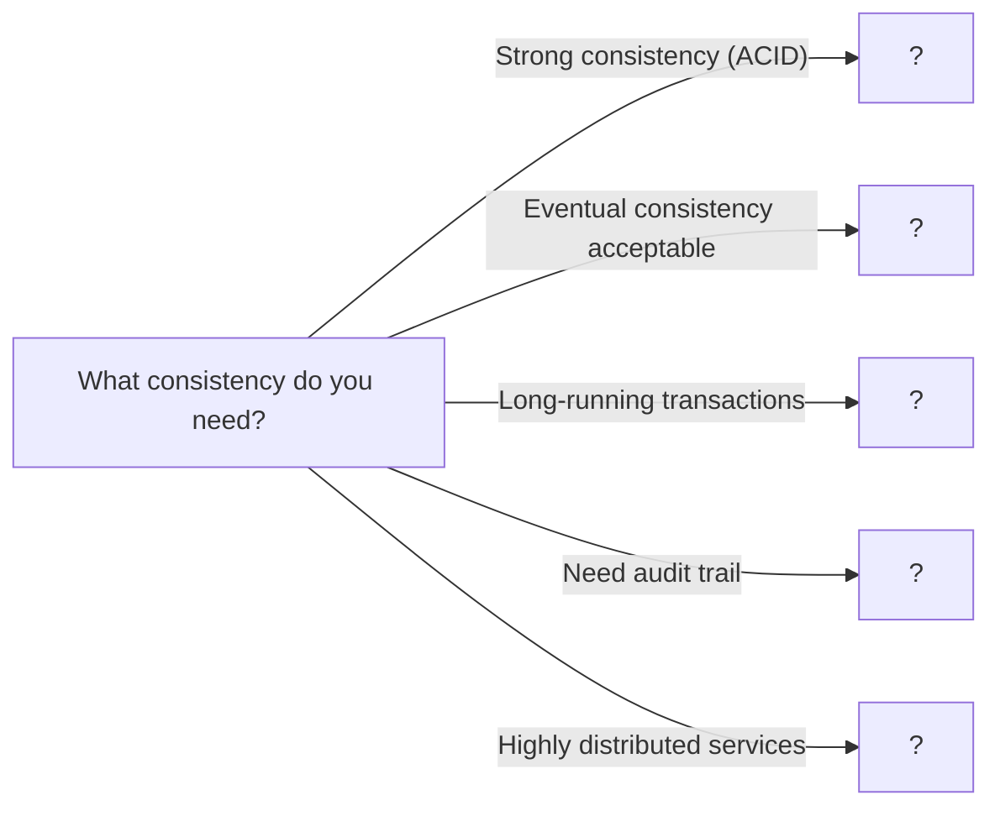

# Distributed Transactions

> Maintaining consistency across multiple services and databases

---

## Learning Objectives

By the end of this section you should be able to:

- Explain the two phases of 2PC (prepare and commit) and identify the conditions under which it blocks
- Implement a Saga orchestrator with sequential steps and reverse-order compensation
- Distinguish Saga orchestration from Saga choreography and identify when each is more appropriate
- Implement idempotent compensating actions and explain why idempotency is required, not optional
- Describe the orphaned-saga problem and design a recovery mechanism using durable saga logs
- Choose between 2PC and Saga for a given consistency, latency, and availability requirement

---

!!! warning "Operational reality"
    Sagas are the correct pattern for distributed transactions — 2PC is genuinely problematic at scale — but debugging a saga that has half-compensated across four services at 3am is a special kind of difficult. Compensating transactions assume compensation is always possible and idempotent, which it often is not (you cannot un-send an email). The saga coordinator or choreography event chain tends to become the most critical and least-understood component in the system.

    Most teams benefit more from designing for idempotency and accepting eventual consistency than from building a full saga framework. Study the pattern to understand the tradeoffs; reach for it sparingly.

## ELI5: Explain Like I'm 5

<div class="learner-section" markdown>

**Your task:** After implementing distributed transaction patterns, explain them simply.

**Prompts to guide you:**

1. **What is a distributed transaction in one sentence?**
    - Your answer: <span class="fill-in">A distributed transaction is a ___ that must either fully ___ or fully ___ across multiple services</span>

2. **Why are distributed transactions hard?**
    - Your answer: <span class="fill-in">They are hard because ___ can fail independently, so there is no single ___ that can guarantee ___</span>

3. **Real-world analogy for 2PC:**
    - Example: "Two-phase commit is like a wedding ceremony where..."
    - Your analogy: <span class="fill-in">[Fill in]</span>

4. **What is the Saga pattern in one sentence?**
    - Your answer: <span class="fill-in">A Saga is a sequence of ___ steps where each step has a ___ that undoes it if ___</span>

5. **How is orchestration different from choreography?**
    - Your answer: <span class="fill-in">Orchestration has a ___ that tells each service what to do; choreography has services ___ reacting to ___</span>

6. **Real-world analogy for Saga choreography:**
    - Example: "Saga choreography is like a relay race where..."
    - Your analogy: <span class="fill-in">[Fill in]</span>

7. **What is compensation in one sentence?**
    - Your answer: <span class="fill-in">Compensation is a ___ that ___ the effect of a previous step when the overall Saga ___</span>

8. **When would you use event sourcing?**
    - Your answer: <span class="fill-in">Use event sourcing when you need a ___ of all changes for ___ or ___</span>

</div>

---

## Quick Quiz (Do BEFORE implementing)

!!! tip "How to use this section"
    Fill in your best guesses **before** reading any code. After implementing each pattern, return here and check your predictions. The compensation-order question is intentionally tricky — many engineers get this wrong until they trace through a failure scenario.

<div class="learner-section" markdown>

**Your task:** Test your intuition without looking at code. Answer these, then verify after implementation.

### Complexity Predictions

1. **Two-phase commit with 3 participants:**
    - Network round trips: <span class="fill-in">[Your guess: ?]</span>
    - Verified after learning: <span class="fill-in">[Actual: ?]</span>

2. **Saga with 5 steps:**
    - If 3rd step fails, how many compensations? <span class="fill-in">[Your guess: ?]</span>
    - Verified: <span class="fill-in">[Actual: ?]</span>

3. **Consistency guarantees:**
    - 2PC provides: <span class="fill-in">[Strong/Eventual consistency?]</span>
    - Saga provides: <span class="fill-in">[Strong/Eventual consistency?]</span>
    - Verified: <span class="fill-in">[Actual answers]</span>

### Scenario Predictions

**Scenario 1:** Transfer $100 from Account A to Account B across different databases

- **Can you use 2PC?** <span class="fill-in">[Yes/No - Why?]</span>
- **What if one database is down during commit phase?** <span class="fill-in">[What happens?]</span>
- **Is the transaction atomic?** <span class="fill-in">[Yes/No - Explain]</span>

**Scenario 2:** Order processing: Reserve inventory → Charge payment → Ship order

- **Can you use 2PC?** <span class="fill-in">[Yes/No - Why?]</span>
- **What if payment fails after inventory is reserved?** <span class="fill-in">[How to handle?]</span>
- **Should you use orchestration or choreography?** <span class="fill-in">[Fill in reasoning]</span>

**Scenario 3:** Payment service charged customer but shipping service is down

- **With 2PC, can this happen?** <span class="fill-in">[Yes/No - Why?]</span>
- **With Saga, can this happen?** <span class="fill-in">[Yes/No - Why?]</span>
- **How would you recover?** <span class="fill-in">[Fill in your approach]</span>

### Trade-off Quiz

**Question:** When would 2PC be WORSE than Saga for distributed transactions?

- Your answer: <span class="fill-in">[Fill in before implementation]</span>
- Verified answer: <span class="fill-in">[Fill in after learning]</span>

**Question:** What's the MAIN challenge with compensation in Saga?

- [ ] Compensation must be idempotent
- [ ] Compensation can fail
- [ ] Order matters (reverse order)
- [ ] All of the above

Verify after implementation: <span class="fill-in">[Which one(s)?]</span>

**Question:** Why does 2PC block while Saga doesn't?

- Your answer: <span class="fill-in">[Fill in before implementation]</span>
- Verified answer: <span class="fill-in">[Fill in after learning]</span>

</div>

---

## Core Implementation

### Part 1: Two-Phase Commit (2PC)

**Your task:** Implement basic 2PC protocol.

```java
import java.util.*;

/**
 * Two-Phase Commit: Atomic commit across multiple participants
 *
 * Key principles:
 * - Phase 1: Prepare (voting)
 * - Phase 2: Commit/Abort (decision)
 * - Coordinator manages protocol
 * - All or nothing semantics
 */

public class TwoPhaseCommit {

    private final List<Participant> participants;
    private final TransactionLog log;

    /**
     * Initialize 2PC coordinator
     *
     * @param participants List of transaction participants
     *
     * TODO: Initialize coordinator
     * - Store participants
     * - Create transaction log
     */
    public TwoPhaseCommit(List<Participant> participants) {
        // TODO: Store participants list

        // TODO: Create transaction log

        this.participants = null; // Replace
        this.log = null; // Replace
    }

    /**
     * Execute distributed transaction
     *
     * @param transactionId Transaction identifier
     * @param operations Operations to execute
     * @return Transaction result
     *
     * TODO: Implement 2PC protocol
     * Phase 1: Prepare
     *   - Send prepare to all participants
     *   - Collect votes (YES/NO)
     *   - If any NO, abort
     * Phase 2: Commit/Abort
     *   - If all YES, send commit to all
     *   - If any NO, send abort to all
     *   - Wait for acknowledgments
     */
    public TransactionResult executeTransaction(String transactionId,
                                                Map<Participant, String> operations) {
        // TODO: Log transaction start
        log.write("START " + transactionId);

        // PHASE 1: PREPARE
        System.out.println("Phase 1: Prepare");

        // TODO: Send prepare to all participants
        Map<Participant, Vote> votes = new HashMap<>();
        for (Map.Entry<Participant, String> entry : participants) {
            // TODO: Send prepare request
            // Vote vote = participant.prepare(transactionId, operation)
            // Store vote
        }

        // TODO: Check if all voted YES
        boolean allYes = true; // Calculate this

        // PHASE 2: COMMIT or ABORT
        if (allYes) {
            System.out.println("Phase 2: Commit");
            // TODO: Send commit to all participants
            // TODO: Log commit
            // TODO: Return success

        } else {
            System.out.println("Phase 2: Abort");
            // TODO: Send abort to all participants
            // TODO: Log abort
            // TODO: Return failure
        }

        return null; // Replace
    }

    /**
     * Participant in distributed transaction
     */
    static class Participant {
        String id;
        Map<String, String> preparedTransactions; // transactionId -> data

        public Participant(String id) {
            this.id = id;
            this.preparedTransactions = new HashMap<>();
        }

        /**
         * Prepare phase: Can you commit?
         *
         * TODO: Prepare transaction
         * - Check if can commit (resources available, no conflicts)
         * - If yes, lock resources and save state
         * - Return YES or NO vote
         */
        public Vote prepare(String transactionId, String operation) {
            System.out.println(id + " preparing: " + operation);

            // TODO: Check if can commit (simulate)

            // Simulate: random failure 20% of time
            if (Math.random() < 0.2) {
                System.out.println(id + " votes NO");
                return Vote.NO;
            }

            preparedTransactions.put(transactionId, operation);
            System.out.println(id + " votes YES");
            return Vote.YES;
        }

        /**
         * Commit phase: Execute the transaction
         *
         * TODO: Commit transaction
         * - Apply prepared changes
         * - Release locks
         * - Clean up prepared state
         */
        public void commit(String transactionId) {
            System.out.println(id + " committing");
            // TODO: Apply changes
            // TODO: Clean up prepared state
            preparedTransactions.remove(transactionId);
        }

        /**
         * Abort phase: Rollback the transaction
         *
         * TODO: Abort transaction
         * - Discard prepared changes
         * - Release locks
         * - Clean up prepared state
         */
        public void abort(String transactionId) {
            System.out.println(id + " aborting");
            // TODO: Rollback changes
            // TODO: Clean up prepared state
            preparedTransactions.remove(transactionId);
        }
    }

    enum Vote {
        YES, NO
    }

    static class TransactionLog {
        List<String> entries;

        public TransactionLog() {
            this.entries = new ArrayList<>();
        }

        public void write(String entry) {
            entries.add(System.currentTimeMillis() + ": " + entry);
        }
    }

    static class TransactionResult {
        boolean success;
        String message;

        public TransactionResult(boolean success, String message) {
            this.success = success;
            this.message = message;
        }
    }
}
```

!!! warning "Debugging Challenge — 2PC Blocking on Coordinator Crash"
    The following code simulates the classic 2PC blocking problem. A coordinator crashes after sending commit to the first participant but before reaching the second.

    ```java
    public void commitPhase(String txId, List<Participant> participants) {
        for (Participant p : participants) {
            p.commit(txId);
            // Coordinator crashes here after first commit!
        }
    }
    ```

    - What state is `participants.get(1)` in after the crash?
    - Is it safe for that participant to abort on its own? Why or why not?
    - What mechanism prevents this from causing permanent inconsistency in production systems?

    ??? success "Answer"
        **State after crash:** `participants.get(1)` is in the PREPARED state. It holds locks on its resources and is waiting indefinitely for a commit or abort instruction from the coordinator that will never come.

        **Why it cannot abort alone:** `participants.get(0)` has already committed. If `participants.get(1)` aborts, the two participants are in different final states — a clear consistency violation (the transaction partially committed).

        **Production mechanism:** The coordinator must durably log the COMMIT_DECISION before sending any commit messages. On recovery, a new coordinator reads the log and resends commits to all participants that have not yet acknowledged. Participants also implement a timeout-and-query protocol: after a timeout, they contact other participants to learn whether anyone has already committed, which reveals the coordinator's original decision.

---

### Part 2: Saga Pattern - Orchestration

**Your task:** Implement Saga with centralized orchestrator.

```java
/**
 * Saga Orchestration: Centralized coordinator manages workflow
 *
 * Key principles:
 * - Orchestrator controls flow
 * - Sequential steps with compensation
 * - Rollback on failure
 * - Each step has compensating action
 */

public class SagaOrchestrator {

    private final List<SagaStep> steps;

    /**
     * Initialize Saga orchestrator
     *
     * TODO: Initialize step list
     */
    public SagaOrchestrator() {
        // TODO: Initialize steps list
        this.steps = null; // Replace
    }

    /**
     * Add step to saga
     *
     * @param step Saga step with transaction and compensation
     */
    public void addStep(SagaStep step) {
        // TODO: Add step to list
    }

    /**
     * Execute saga
     *
     * TODO: Execute all steps sequentially
     * 1. Execute each step's transaction
     * 2. If any step fails:
     *    - Execute compensation for completed steps
     *    - Return failure
     * 3. If all succeed, return success
     */
    public SagaResult execute(SagaContext context) {
        List<SagaStep> completedSteps = new ArrayList<>();

        System.out.println("Starting Saga execution");

        // TODO: Execute each step
        for (SagaStep step : steps) {
            try {
                System.out.println("Executing: " + step.getName());
                // TODO: Execute step transaction
                // step.execute(context)

                // TODO: Add to completed steps

            } catch (Exception e) {
                System.out.println("Step failed: " + step.getName());

                // TODO: Compensate completed steps in reverse order
                System.out.println("Starting compensation");
                // for (int i = completedSteps.size() - 1; i >= 0; i--):
                //   completedSteps.get(i).compensate(context)

                // TODO: Return failure
                return new SagaResult(false, "Failed at: " + step.getName());
            }
        }

        // TODO: All steps succeeded
        System.out.println("Saga completed successfully");
        return new SagaResult(true, "Success");
    }

    /**
     * Saga step with transaction and compensation
     */
    static abstract class SagaStep {
        String name;

        public SagaStep(String name) {
            this.name = name;
        }

        public String getName() {
            return name;
        }

        /**
         * Execute forward transaction
         */
        public abstract void execute(SagaContext context) throws Exception;

        /**
         * Execute compensating transaction
         */
        public abstract void compensate(SagaContext context);
    }

    /**
     * Saga execution context (shared state)
     */
    static class SagaContext {
        Map<String, Object> data;

        public SagaContext() {
            this.data = new HashMap<>();
        }

        public void put(String key, Object value) {
            data.put(key, value);
        }

        public Object get(String key) {
            return data.get(key);
        }
    }

    static class SagaResult {
        boolean success;
        String message;

        public SagaResult(boolean success, String message) {
            this.success = success;
            this.message = message;
        }
    }
}
```

---

### Part 3: Saga Pattern - Choreography

**Your task:** Implement Saga with event-based choreography.

```java
/**
 * Saga Choreography: Event-driven with no central coordinator
 *
 * Key principles:
 * - Services listen for events
 * - Each service knows next step
 * - Decentralized control
 * - Event-driven compensation
 */

public class SagaChoreography {

    private final Map<String, List<EventHandler>> eventHandlers;
    private final EventBus eventBus;

    /**
     * Initialize choreography
     *
     * TODO: Initialize event system
     * - Create event bus
     * - Create handler registry
     */
    public SagaChoreography() {
        // TODO: Initialize eventHandlers map

        // TODO: Create event bus

        this.eventHandlers = null; // Replace
        this.eventBus = null; // Replace
    }

    /**
     * Register event handler
     *
     * @param eventType Event type to listen for
     * @param handler Handler to execute
     *
     * TODO: Register handler for event type
     */
    public void registerHandler(String eventType, EventHandler handler) {
        // TODO: Get or create handler list for event type

        // TODO: Add handler to list
    }

    /**
     * Publish event
     *
     * TODO: Publish event to all registered handlers
     * - Get handlers for event type
     * - Execute each handler
     * - Handlers may publish new events
     */
    public void publishEvent(Event event) {
        System.out.println("Event published: " + event.type);

        // TODO: Get handlers for event type

        // TODO: Execute each handler
    }

    /**
     * Start saga by publishing initial event
     */
    public void startSaga(Event initialEvent) {
        // TODO: Publish initial event
        publishEvent(initialEvent);
    }

    /**
     * Event handler interface
     */
    interface EventHandler {
        void handle(Event event, EventBus eventBus);
    }

    /**
     * Event bus for publishing events
     */
    static class EventBus {
        SagaChoreography choreography;

        public EventBus(SagaChoreography choreography) {
            this.choreography = choreography;
        }

        public void publish(Event event) {
            choreography.publishEvent(event);
        }
    }

    /**
     * Event in the saga
     */
    static class Event {
        String type;
        Map<String, Object> data;

        public Event(String type) {
            this.type = type;
            this.data = new HashMap<>();
        }

        public void put(String key, Object value) {
            data.put(key, value);
        }

        public Object get(String key) {
            return data.get(key);
        }
    }
}
```

---

### Part 4: Compensation Pattern

**Your task:** Implement compensating transactions.

```java
/**
 * Compensation: Undo completed operations on failure
 *
 * Key principles:
 * - Each operation has compensating action
 * - Compensation executed in reverse order
 * - Semantic rollback (not physical)
 * - Eventually consistent
 */

public class CompensationHandler {

    private final Stack<CompensatingAction> completedActions;

    /**
     * Initialize compensation handler
     *
     * TODO: Initialize action stack
     */
    public CompensationHandler() {
        // TODO: Create stack for completed actions
        this.completedActions = null; // Replace
    }

    /**
     * Execute action and record for compensation
     *
     * @param action Action to execute
     * @return true if successful
     *
     * TODO: Execute and record action
     * - Try to execute action
     * - If success, push to stack
     * - If failure, return false
     */
    public boolean executeWithCompensation(CompensatingAction action) {
        try {
            System.out.println("Executing: " + action.getName());
            // TODO: Execute action
            // action.execute()

            // TODO: Push to stack for potential compensation

            return true;

        } catch (Exception e) {
            System.out.println("Action failed: " + action.getName());
            return false;
        }
    }

    /**
     * Compensate all completed actions
     *
     * TODO: Execute compensating actions in reverse order
     * - Pop actions from stack
     * - Execute compensation for each
     * - Handle compensation failures
     */
    public void compensateAll() {
        System.out.println("Starting compensation");

        // TODO: Implement iteration/conditional logic

        while (!completedActions.isEmpty()) {
            CompensatingAction action = completedActions.pop();
            try {
                System.out.println("Compensating: " + action.getName());
                // TODO: Execute compensation
                // action.compensate()
            } catch (Exception e) {
                System.out.println("Compensation failed: " + action.getName());
                // TODO: Log failure but continue compensating
            }
        }
    }

    /**
     * Clear compensation stack (after successful completion)
     */
    public void clear() {
        // TODO: Clear the stack
    }

    /**
     * Action with compensating logic
     */
    static abstract class CompensatingAction {
        String name;

        public CompensatingAction(String name) {
            this.name = name;
        }

        public String getName() {
            return name;
        }

        /**
         * Execute forward action
         */
        public abstract void execute() throws Exception;

        /**
         * Execute compensating action
         */
        public abstract void compensate() throws Exception;
    }
}
```

---

### Part 5: Event Sourcing

**Your task:** Implement event sourcing for transaction history.

```java
/**
 * Event Sourcing: Store events instead of current state
 *
 * Key principles:
 * - All changes stored as events
 * - Current state derived from events
 * - Complete audit trail
 * - Time travel (replay to any point)
 */

public class EventSourcedAggregate {

    private final String aggregateId;
    private final List<DomainEvent> events;
    private int version;

    /**
     * Initialize event sourced aggregate
     *
     * @param aggregateId Unique identifier
     *
     * TODO: Initialize aggregate
     * - Store aggregate ID
     * - Create events list
     * - Set version to 0
     */
    public EventSourcedAggregate(String aggregateId) {
        // TODO: Store aggregateId

        // TODO: Initialize events list

        // TODO: Track state

        this.aggregateId = null; // Replace
        this.events = null; // Replace
        this.version = 0;
    }

    /**
     * Apply and record event
     *
     * @param event Event to apply
     *
     * TODO: Apply event
     * - Add event to list
     * - Increment version
     * - Apply state change
     */
    public void applyEvent(DomainEvent event) {
        // TODO: Set event version

        // TODO: Add to events list

        // TODO: Increment version

        // TODO: Apply state change (handled by subclass)

        System.out.println("Event applied: " + event);
    }

    /**
     * Replay events to reconstruct state
     *
     * @param events Historical events
     *
     * TODO: Replay all events
     * - Clear current state
     * - Apply each event in order
     * - Reconstruct current state
     */
    public void replayEvents(List<DomainEvent> events) {
        System.out.println("Replaying " + events.size() + " events");

        // TODO: Implement iteration/conditional logic
    }

    /**
     * Get events after specific version
     *
     * TODO: Filter events by version
     */
    public List<DomainEvent> getEventsSince(int version) {
        // TODO: Filter events where event.version > version
        return null; // Replace
    }

    /**
     * Get all events
     */
    public List<DomainEvent> getAllEvents() {
        return new ArrayList<>(events);
    }

    /**
     * Get current version
     */
    public int getVersion() {
        return version;
    }

    /**
     * Domain event
     */
    static class DomainEvent {
        String aggregateId;
        String eventType;
        int version;
        long timestamp;
        Map<String, Object> data;

        public DomainEvent(String aggregateId, String eventType) {
            this.aggregateId = aggregateId;
            this.eventType = eventType;
            this.timestamp = System.currentTimeMillis();
            this.data = new HashMap<>();
        }

        public void put(String key, Object value) {
            data.put(key, value);
        }

        public Object get(String key) {
            return data.get(key);
        }

        @Override
        public String toString() {
            return "Event{type='" + eventType + "', version=" + version + "}";
        }
    }
}
```

---

## Client Code

```java
import java.util.*;

public class DistributedTransactionsClient {

    public static void main(String[] args) {
        testTwoPhaseCommit();
        System.out.println("\n" + "=".repeat(50) + "\n");
        testSagaOrchestration();
        System.out.println("\n" + "=".repeat(50) + "\n");
        testSagaChoreography();
        System.out.println("\n" + "=".repeat(50) + "\n");
        testCompensation();
        System.out.println("\n" + "=".repeat(50) + "\n");
        testEventSourcing();
    }

    static void testTwoPhaseCommit() {
        System.out.println("=== Two-Phase Commit Test ===\n");

        // Create participants
        List<TwoPhaseCommit.Participant> participants = Arrays.asList(
            new TwoPhaseCommit.Participant("Database-A"),
            new TwoPhaseCommit.Participant("Database-B"),
            new TwoPhaseCommit.Participant("Database-C")
        );

        TwoPhaseCommit coordinator = new TwoPhaseCommit(participants);

        // Execute transaction
        Map<TwoPhaseCommit.Participant, String> operations = new HashMap<>();
        for (TwoPhaseCommit.Participant p : participants) {
            operations.put(p, "UPDATE balance SET amount = amount - 100");
        }

        TwoPhaseCommit.TransactionResult result =
            coordinator.executeTransaction("tx123", operations);

        System.out.println("\nResult: " + result.message);
    }

    static void testSagaOrchestration() {
        System.out.println("=== Saga Orchestration Test ===\n");

        SagaOrchestrator saga = new SagaOrchestrator();

        // Define saga steps
        saga.addStep(new SagaOrchestrator.SagaStep("Reserve Inventory") {
            @Override
            public void execute(SagaOrchestrator.SagaContext context) throws Exception {
                System.out.println("  -> Reserving inventory");
                context.put("inventoryReserved", true);
                // Simulate occasional failure
                if (Math.random() < 0.3) {
                    throw new Exception("Out of stock");
                }
            }

            @Override
            public void compensate(SagaOrchestrator.SagaContext context) {
                System.out.println("  -> Releasing inventory");
                context.put("inventoryReserved", false);
            }
        });

        saga.addStep(new SagaOrchestrator.SagaStep("Process Payment") {
            @Override
            public void execute(SagaOrchestrator.SagaContext context) throws Exception {
                System.out.println("  -> Processing payment");
                context.put("paymentProcessed", true);
            }

            @Override
            public void compensate(SagaOrchestrator.SagaContext context) {
                System.out.println("  -> Refunding payment");
                context.put("paymentProcessed", false);
            }
        });

        saga.addStep(new SagaOrchestrator.SagaStep("Ship Order") {
            @Override
            public void execute(SagaOrchestrator.SagaContext context) throws Exception {
                System.out.println("  -> Shipping order");
                context.put("orderShipped", true);
            }

            @Override
            public void compensate(SagaOrchestrator.SagaContext context) {
                System.out.println("  -> Canceling shipment");
                context.put("orderShipped", false);
            }
        });

        // Execute saga
        SagaOrchestrator.SagaContext context = new SagaOrchestrator.SagaContext();
        SagaOrchestrator.SagaResult result = saga.execute(context);

        System.out.println("\nResult: " + result.message);
    }

    static void testSagaChoreography() {
        System.out.println("=== Saga Choreography Test ===\n");

        SagaChoreography choreography = new SagaChoreography();

        // Register event handlers
        choreography.registerHandler("OrderCreated", (event, bus) -> {
            System.out.println("  -> Handling OrderCreated");
            System.out.println("  -> Reserving inventory");

            // Publish next event
            SagaChoreography.Event inventoryReserved =
                new SagaChoreography.Event("InventoryReserved");
            inventoryReserved.put("orderId", event.get("orderId"));
            bus.publish(inventoryReserved);
        });

        choreography.registerHandler("InventoryReserved", (event, bus) -> {
            System.out.println("  -> Handling InventoryReserved");
            System.out.println("  -> Processing payment");

            // Publish next event
            SagaChoreography.Event paymentProcessed =
                new SagaChoreography.Event("PaymentProcessed");
            paymentProcessed.put("orderId", event.get("orderId"));
            bus.publish(paymentProcessed);
        });

        choreography.registerHandler("PaymentProcessed", (event, bus) -> {
            System.out.println("  -> Handling PaymentProcessed");
            System.out.println("  -> Shipping order");

            SagaChoreography.Event orderShipped =
                new SagaChoreography.Event("OrderShipped");
            orderShipped.put("orderId", event.get("orderId"));
            System.out.println("  -> Saga complete!");
        });

        // Start saga
        SagaChoreography.Event orderCreated =
            new SagaChoreography.Event("OrderCreated");
        orderCreated.put("orderId", "order123");
        choreography.startSaga(orderCreated);
    }

    static void testCompensation() {
        System.out.println("=== Compensation Test ===\n");

        CompensationHandler handler = new CompensationHandler();

        // Define compensating actions
        boolean success = true;

        success = handler.executeWithCompensation(
            new CompensationHandler.CompensatingAction("Deduct Balance") {
                @Override
                public void execute() throws Exception {
                    System.out.println("  -> Balance deducted");
                }

                @Override
                public void compensate() throws Exception {
                    System.out.println("  -> Balance restored");
                }
            }
        );

        if (!success) return;

        success = handler.executeWithCompensation(
            new CompensationHandler.CompensatingAction("Send Email") {
                @Override
                public void execute() throws Exception {
                    System.out.println("  -> Email sent");
                    // Simulate failure
                    if (Math.random() < 0.5) {
                        throw new Exception("Email service down");
                    }
                }

                @Override
                public void compensate() throws Exception {
                    System.out.println("  -> Cancellation email sent");
                }
            }
        );

        if (!success) {
            System.out.println("\nOperation failed, compensating...");
            handler.compensateAll();
        } else {
            System.out.println("\nAll operations successful");
            handler.clear();
        }
    }

    static void testEventSourcing() {
        System.out.println("=== Event Sourcing Test ===\n");

        EventSourcedAggregate account = new EventSourcedAggregate("account123");

        // Apply events
        System.out.println("Applying events:");

        EventSourcedAggregate.DomainEvent created =
            new EventSourcedAggregate.DomainEvent("account123", "AccountCreated");
        created.put("initialBalance", 1000);
        account.applyEvent(created);

        EventSourcedAggregate.DomainEvent deposited =
            new EventSourcedAggregate.DomainEvent("account123", "MoneyDeposited");
        deposited.put("amount", 500);
        account.applyEvent(deposited);

        EventSourcedAggregate.DomainEvent withdrawn =
            new EventSourcedAggregate.DomainEvent("account123", "MoneyWithdrawn");
        withdrawn.put("amount", 200);
        account.applyEvent(withdrawn);

        System.out.println("\nCurrent version: " + account.getVersion());
        System.out.println("Total events: " + account.getAllEvents().size());

        // Replay events
        System.out.println("\nReplaying events:");
        EventSourcedAggregate newAccount = new EventSourcedAggregate("account123");
        newAccount.replayEvents(account.getAllEvents());

        System.out.println("Reconstructed version: " + newAccount.getVersion());
    }
}
```

!!! info "Loop back"
    Now that you have implemented all five patterns, return to the **Quick Quiz** at the top of this page. Fill in the "Verified after learning" fields. Were your predictions about 2PC blocking correct? Did you underestimate the compensation challenges? Return to the **ELI5** section and complete all eight fill-in sentences.

---

## Before/After: Why This Pattern Matters

!!! note "Key insight"
    2PC and Saga are not simply "strong vs eventual" — they represent fundamentally different availability trade-offs. 2PC makes a system unavailable whenever any participant is unavailable. Saga keeps each service independently available but requires you to design compensation logic for every forward step. The cost of Saga is complexity; the cost of 2PC is availability.

**Your task:** Compare naive vs optimized approaches to understand the impact.

### Example: E-Commerce Order Processing

**Problem:** Process an order involving inventory, payment, and shipping across 3 microservices.

#### Approach 1: Naive Distributed Operations (No Transaction Management)

```java
// Naive approach - Just call services, hope for the best
public class NaiveOrderProcessing {

    public boolean processOrder(Order order) {
        // Step 1: Reserve inventory
        inventoryService.reserve(order.items);

        // Step 2: Charge payment
        paymentService.charge(order.customerId, order.amount);

        // Step 3: Create shipment
        shippingService.createShipment(order);

        return true;
    }
}
```

**Problems:**

- **No rollback:** If payment fails, inventory stays reserved forever
- **Partial failures:** Customer charged but shipment never created
- **No consistency:** Services can be in inconsistent states
- **No retry logic:** Transient failures cause permanent data corruption
- **Debugging nightmare:** Can't tell which step failed or what state the system is in

**Real failure scenario:**

```
Step 1: Inventory reserved ✓
Step 2: Payment charged ✓
Step 3: Shipping service crashes ✗
Result: Customer charged, inventory locked, no shipment!
```

#### Approach 2: Two-Phase Commit (Strong Consistency)

```java
// 2PC approach - Coordinated commit across all services
public class TwoPhaseCommitOrderProcessing {

    public boolean processOrder(Order order) {
        String txId = generateTransactionId();

        // PHASE 1: PREPARE - Ask all services if they can commit
        boolean inventoryReady = inventoryService.prepare(txId, order.items);
        boolean paymentReady = paymentService.prepare(txId, order.customerId, order.amount);
        boolean shippingReady = shippingService.prepare(txId, order);

        // PHASE 2: COMMIT or ABORT
        if (inventoryReady && paymentReady && shippingReady) {
            // All ready - commit everywhere
            inventoryService.commit(txId);
            paymentService.commit(txId);
            shippingService.commit(txId);
            return true;
        } else {
            // Someone can't commit - abort everywhere
            inventoryService.abort(txId);
            paymentService.abort(txId);
            shippingService.abort(txId);
            return false;
        }
    }
}
```

**Benefits:**

- **Atomic:** Either all commit or all abort
- **Strong consistency:** No partial states
- **Locks held:** Resources reserved during prepare

**Drawbacks:**

- **Blocking:** If coordinator crashes, participants locked
- **Latency:** 2 network round trips minimum
- **Availability:** Any participant down = whole transaction fails
- **Not suitable for:** Long-running operations, high-latency networks

#### Approach 3: Saga Pattern (Eventual Consistency)

```java
// Saga approach - Sequential steps with compensation
public class SagaOrderProcessing {

    public boolean processOrder(Order order) {
        List<CompletedStep> completed = new ArrayList<>();

        try {
            // Step 1: Reserve inventory
            inventoryService.reserve(order.items);
            completed.add(new CompletedStep("inventory",
                () -> inventoryService.releaseReservation(order.items)));

            // Step 2: Charge payment
            paymentService.charge(order.customerId, order.amount);
            completed.add(new CompletedStep("payment",
                () -> paymentService.refund(order.customerId, order.amount)));

            // Step 3: Create shipment
            shippingService.createShipment(order);
            completed.add(new CompletedStep("shipping",
                () -> shippingService.cancelShipment(order)));

            return true;

        } catch (Exception e) {
            // Compensate in reverse order
            for (int i = completed.size() - 1; i >= 0; i--) {
                completed.get(i).compensate();
            }
            return false;
        }
    }
}
```

**Benefits:**

- **Non-blocking:** No locks held between steps
- **Eventual consistency:** System reaches consistent state
- **Resilient:** Can handle long-running operations
- **Suitable for:** Microservices, distributed systems

**Drawbacks:**

- **Compensation complexity:** Must implement reverse operations
- **Intermediate states visible:** Brief inconsistency possible
- **Idempotency required:** Compensations may retry
- **No isolation:** Other transactions may see partial state

#### Performance Comparison

| Aspect               | Naive            | 2PC                    | Saga                        |
|----------------------|------------------|------------------------|-----------------------------|
| **Consistency**      | None             | Strong (ACID)          | Eventual                    |
| **Availability**     | High             | Low (any down = fail)  | High                        |
| **Latency**          | 1 round trip     | 2+ round trips         | 1 round trip per step       |
| **Blocking**         | No               | Yes (locks held)       | No                          |
| **Partial failures** | Corrupt data     | All abort              | Compensate                  |
| **Complexity**       | Low              | Medium                 | High                        |
| **Best for**         | Nothing (unsafe) | Small, fast operations | Long-running, microservices |

**Latency Example (3 services, 50ms network latency each):**

- **Naive:** ~150ms (3 sequential calls) - but leaves data corrupt on failure
- **2PC:** ~300ms (prepare phase 150ms + commit phase 150ms)
- **Saga:** ~150ms (3 sequential calls) + compensation time if needed

#### Real-World Impact

**Scenario:** E-commerce site processing 1000 orders/minute

**With 2PC:**

- 1 stuck participant locks 100s of transactions
- Average latency: 300-500ms
- Failure of any service stops all orders
- Good for: Financial transfers, small critical updates

**With Saga:**

- Failures isolated per order
- Average latency: 150-200ms
- Partial failures compensated automatically
- Good for: Order processing, user onboarding, booking systems

**Your calculation:**

- For 5 microservices with 100ms latency each, 2PC takes approximately _____ ms
- Saga with same services takes approximately _____ ms
- If one service has 10% failure rate, 2PC success rate: <span class="fill-in">___</span>_%
- Saga can still complete (with compensation) in: <span class="fill-in">___</span>% of cases

#### Why Does Saga Work?

**Key insight to understand:**

In a long-running order process with potential failures:

```
Saga: Reserve → Charge → Ship (if any fails, undo previous)
```

**Why eventual consistency is acceptable:**

- Customer doesn't see intermediate states (happens in seconds)
- If compensation needed, appears as "order canceled" to user
- Each service independently consistent
- Auditability: Full history of actions + compensations

**After implementing, explain in your own words:**

<div class="learner-section" markdown>

- Why is compensation in reverse order critical? <span class="fill-in">[Your answer]</span>
- What makes a good compensation operation? <span class="fill-in">[Your answer]</span>
- When would you need orchestration vs choreography? <span class="fill-in">[Your answer]</span>

</div>

---

## Case Studies: Distributed Transactions in the Wild

### E-commerce Order Processing: The Saga Pattern

- **Pattern:** Saga (Choreography-based).
- **How it works:** When you place an order on a site like Amazon, multiple microservices are involved. This is not a
  single ACID transaction. Instead, it's a **Saga**:
    1. The **Orders Service** creates an order and saves it with a `PENDING` status. It then publishes an `OrderCreated`
       event.
    2. The **Payments Service** listens for `OrderCreated`, processes the payment, and publishes a `PaymentSucceeded`
       event.
    3. The **Inventory Service** listens for `PaymentSucceeded`, decrements the product stock, and publishes
       `InventoryUpdated`.
    4. **Compensation:** If the payment fails, the Payments Service publishes `PaymentFailed`. The Orders Service
       listens for this and runs a *compensating action* to cancel the order.
- **Key Takeaway:** For long-running business processes that span multiple services, Sagas provide a way to achieve
  eventual consistency without using slow, blocking distributed locks. The key is defining a compensating action for
  every step that could fail.

### Distributed Databases (Google Spanner, CockroachDB): Two-Phase Commit

- **Pattern:** Two-Phase Commit (2PC) integrated with a consensus protocol like Paxos or Raft.
- **How it works:** Modern distributed SQL databases like Spanner and CockroachDB provide ACID transactions across
  multiple machines. When you `BEGIN TRANSACTION` and update records that live on different nodes (shards), the database
  uses a 2PC-like protocol. A **transaction coordinator** first asks all participating nodes if they are ready to
  commit (Phase 1: Prepare). If all nodes agree, the coordinator tells them all to commit (Phase 2: Commit). This
  ensures the transaction is atomic, even across a global cluster.
- **Key Takeaway:** While brittle in traditional applications, 2PC is a core component of modern distributed databases.
  When tightly integrated with consensus protocols, it provides the strong consistency guarantees that developers expect
  from a SQL database, even in a distributed environment.

### Ride-Sharing Apps (Uber, Lyft): Sagas for Trip Management

- **Pattern:** Saga (Orchestration-based).
- **How it works:** A single ride is a long-running process managed by a Saga orchestrator.
    1. **Request Ride:** The orchestrator calls the `MatchingService` to find a driver.
    2. **Driver Found:** The orchestrator calls the `NotificationService` to inform the user.
    3. **Trip Completed:** The driver's app signals the end of the trip. The orchestrator calls the `BillingService` to
       calculate the fare and charge the user.
    4. **Payment Processed:** The orchestrator calls the `RatingsService` to prompt the user and driver for a rating.
- **Key Takeaway:** An orchestrator provides a centralized way to manage a complex workflow. It's easier to see the
  state of the entire process, but it can become a single point of failure and a bottleneck if not designed carefully.
  This contrasts with the choreography approach where services react to each other's events.

---

## Common Misconceptions

!!! warning "Misconception 1: Saga is just a distributed try/catch"
    Saga is often described as "if step N fails, undo steps N-1 through 1." This makes it sound like distributed exception handling. The critical difference is that compensations are **semantic reversals** — they represent meaningful business actions (issue a refund, cancel a reservation), not byte-level rollbacks. A compensation can itself fail, can be seen by other transactions while it is running, and must be idempotent because it may be retried. A simple try/catch offers none of these guarantees.

!!! warning "Misconception 2: 2PC guarantees no data loss"
    2PC guarantees **atomicity** — all participants commit or all abort. It does not guarantee no data loss. If the coordinator crashes after deciding to commit but before all participants receive the decision, some participants are left holding locks in a PREPARED state indefinitely. This is the blocking problem. Data is not corrupted, but the system is unavailable until the coordinator recovers. In practice, this means 2PC requires a highly available, replicated coordinator to be truly safe.

!!! warning "Misconception 3: Choreography is always better than orchestration because it avoids a single point of failure"
    Choreography distributes control so no single service is the coordinator — but it introduces a different problem: the overall Saga state is implicit and scattered across event logs. When a choreography-based Saga gets stuck (e.g., an event is lost), there is no single place to look to understand what happened. Orchestration concentrates failure risk but also concentrates visibility. For complex workflows with many steps and failure modes, an orchestrator with a durable saga log is often easier to operate than choreography.

---

## Decision Framework

<div class="learner-section" markdown>

**Questions to answer after implementation:**

### 1. Pattern Selection

**When to use Two-Phase Commit?**

- Your scenario: <span class="fill-in">[Fill in]</span>
- Key factors: <span class="fill-in">[Fill in]</span>

**When to use Saga (Orchestration)?**

- Your scenario: <span class="fill-in">[Fill in]</span>
- Key factors: <span class="fill-in">[Fill in]</span>

**When to use Saga (Choreography)?**

- Your scenario: <span class="fill-in">[Fill in]</span>
- Key factors: <span class="fill-in">[Fill in]</span>

**When to use Event Sourcing?**

- Your scenario: <span class="fill-in">[Fill in]</span>
- Key factors: <span class="fill-in">[Fill in]</span>

### 2. Trade-offs

**Two-Phase Commit:**

- Pros: <span class="fill-in">[Fill in after understanding]</span>
- Cons: <span class="fill-in">[Fill in after understanding]</span>

**Saga (Orchestration):**

- Pros: <span class="fill-in">[Fill in after understanding]</span>
- Cons: <span class="fill-in">[Fill in after understanding]</span>

**Saga (Choreography):**

- Pros: <span class="fill-in">[Fill in after understanding]</span>
- Cons: <span class="fill-in">[Fill in after understanding]</span>

**Event Sourcing:**

- Pros: <span class="fill-in">[Fill in after understanding]</span>
- Cons: <span class="fill-in">[Fill in after understanding]</span>

### 3. Your Decision Tree

Build your decision tree after practicing:


</div>

---

## Practice

<div class="learner-section" markdown>

### Scenario 1: Banking transfer

**Requirements:**

- Transfer money between accounts
- Accounts in different databases
- Must be atomic (all or nothing)
- Low latency required
- Rare failures acceptable

**Your design:**

- Which pattern would you choose? <span class="fill-in">[Fill in]</span>
- Why? <span class="fill-in">[Fill in]</span>
- How to handle failures? <span class="fill-in">[Fill in]</span>
- Consistency guarantees? <span class="fill-in">[Fill in]</span>

**Failure modes:**

- What happens if the 2PC coordinator crashes after sending "prepare" to both databases but before sending "commit" — can either database unilaterally decide to proceed? <span class="fill-in">[Fill in]</span>
- How does your design behave when the debit succeeds on the source account but the network drops before the credit is confirmed on the destination account? <span class="fill-in">[Fill in]</span>

### Scenario 2: E-commerce order

**Requirements:**

- Order involves: inventory, payment, shipping
- Each service is independent
- Long-running process (minutes)
- Need to handle partial failures
- Must be eventually consistent

**Your design:**

- Which pattern would you choose? <span class="fill-in">[Fill in]</span>
- Why? <span class="fill-in">[Fill in]</span>
- Compensation strategy? <span class="fill-in">[Fill in]</span>
- How to monitor progress? <span class="fill-in">[Fill in]</span>

**Failure modes:**

- What happens if the inventory reservation step succeeds but the saga orchestrator crashes before issuing the payment step — will inventory be held indefinitely? <span class="fill-in">[Fill in]</span>
- How does your design behave when the compensation for "charge payment" (i.e. issue refund) itself fails due to a transient payment gateway error? <span class="fill-in">[Fill in]</span>

### Scenario 3: Account audit system

**Requirements:**

- Need complete history of all changes
- Regulatory compliance
- Ability to replay transactions
- Time-based queries
- High write volume

**Your design:**

- Which pattern would you choose? <span class="fill-in">[Fill in]</span>
- Why? <span class="fill-in">[Fill in]</span>
- Storage strategy? <span class="fill-in">[Fill in]</span>
- Query optimization? <span class="fill-in">[Fill in]</span>

**Failure modes:**

- What happens if an event is written to the event log but the projection that builds the read model crashes before consuming it — is the audit record permanently missing? <span class="fill-in">[Fill in]</span>
- How does your design behave when a consumer replays the event log but the same event is delivered twice due to an at-least-once message broker — will the aggregate state be corrupted? <span class="fill-in">[Fill in]</span>

</div>

---

## Test Your Understanding

Answer these questions without looking at your implementation. They are designed to probe understanding, not recall.

1. **A Saga orchestrator crashes after completing steps 1 and 2 of a 4-step Saga. When it restarts, should it re-execute steps 1 and 2, or skip to step 3? What property of each step determines whether re-execution is safe?**

    ??? success "Rubric"
        A complete answer addresses: (1) the orchestrator should skip to step 3 — it should record completed steps in durable state (e.g. a saga log) before proceeding so it can resume from the correct position after restart; (2) idempotency is the property that makes re-execution safe: if a step is idempotent, running it twice produces the same result as running it once; (3) if steps 1 and 2 are not idempotent, re-executing them after restart would cause double-processing (e.g. double-charging), which is why the saga log / checkpoint pattern is essential and not optional.

2. **Your compensation for "charge payment" is "issue refund." The refund call times out due to a network error. Describe the exact sequence of events that could result in a customer being double-refunded, and explain how you would prevent it.**

    ??? success "Rubric"
        A complete answer addresses: (1) the sequence: (a) saga issues refund, (b) refund succeeds at the payment service but the response is lost in transit, (c) saga times out, marks refund as failed, and retries, (d) second refund also succeeds — customer receives two refunds; (2) prevention requires the refund operation to be idempotent: the saga must generate a stable idempotency key (e.g. derived from the original transaction ID) and pass it on every attempt; the payment service deduplicates on this key so that the second call with the same key is a no-op; (3) bonus: the saga must also persist the idempotency key before the first attempt so it survives a coordinator crash.

3. **You are choosing between 2PC and Saga for a booking system that reserves hotel, flight, and car rental across three third-party APIs. The booking process takes 3-8 seconds. Which pattern is more appropriate, and what is the single most important reason for your choice?**

    ??? success "Rubric"
        A complete answer addresses: (1) Saga is the correct choice; (2) the single most important reason is that 2PC requires all participants to hold locks for the entire duration of the transaction — 3-8 seconds of lock holding across third-party APIs is operationally infeasible and would cause timeout failures and cascading lock contention; (3) a secondary correct point is that third-party APIs do not implement the 2PC protocol (they expose REST endpoints, not distributed transaction participants), so 2PC is architecturally impossible in this context regardless of lock duration.

4. **In event sourcing, a bug was deployed that caused 100 events to be recorded with incorrect data. How do you fix the current state of the aggregate without deleting any events from the event log?**

    ??? success "Rubric"
        A complete answer addresses: (1) do not delete or mutate the incorrect events — the log is append-only and immutable; (2) append corrective events (compensating events) that semantically undo the effect of the bad events, then append the correct events; (3) rebuild (replay) the aggregate's read model/projection from the full event log including the corrective events — the current state will then reflect the corrected history; (4) optionally, flag the erroneous events with metadata for audit purposes; the key insight is that in event sourcing correctness is achieved by appending, not by modifying.

5. **Design decision: You are building a multi-step onboarding flow: create account → send welcome email → assign free credits → notify analytics. If the credits step fails, should you compensate by deleting the account? Justify your answer by discussing what "compensation" means semantically for each completed step.**

    ??? success "Rubric"
        A complete answer addresses: (1) no — deleting the account is almost certainly the wrong compensation; (2) compensation must be semantically meaningful: "create account" compensation would be "delete account", but the account creation is valuable on its own and the credits failure is an independent problem; (3) "send welcome email" has no practical compensation — you cannot un-send an email, so this step is inherently not compensatable and the saga design must accept this; (4) the correct approach is to make the credits assignment retryable (with a background job) rather than rolling back upstream steps that completed successfully; (5) this illustrates that not every saga step has a meaningful compensation and saga design requires reasoning about semantic reversibility, not just mechanical undo.

---

## Connected Topics

!!! info "Where this topic connects"

    - **11. Database Scaling** — sharding makes cross-shard transactions the canonical saga use case; distributed transactions exist because single-node ACID doesn't scale horizontally → [11. Database Scaling](11-database-scaling.md)
    - **12. Message Queues** — saga choreography uses message queues as the backbone; exactly-once delivery semantics directly affect saga correctness → [12. Message Queues](12-message-queues.md)
    - **18. Consensus Patterns** — two-phase commit requires a coordinator; consensus (Raft/Paxos) is the mechanism used to make that coordinator fault-tolerant → [18. Consensus Patterns](18-consensus-patterns.md)
