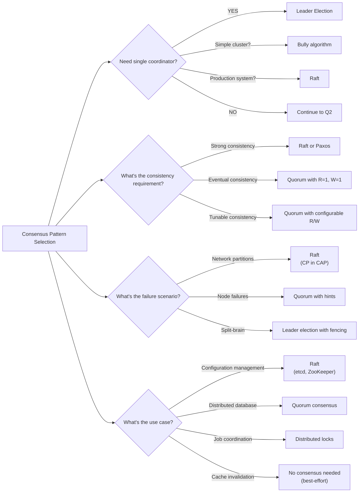

# Consensus Patterns

> Leader election, Raft consensus, distributed locks, and quorum-based systems

---

## Learning Objectives

By the end of this section you should be able to:

- Explain why majority quorum prevents split-brain and prove it using the overlap property
- Describe the three Raft roles (leader, candidate, follower), the term counter, and why terms prevent stale leaders
- Identify the two bugs in a broken leader election implementation and explain which safety property each violates
- Implement distributed lock acquisition with TTL and fencing tokens, and explain what fencing protects against
- Calculate quorum sizes (R and W) for a given replication factor and consistency requirement
- Choose between leader-based (Raft) and leaderless (quorum) consensus for a given use case

---

!!! warning "Operational reality"
    You will almost certainly never implement Raft or Paxos directly. The practical skill is knowing when to reach for etcd, ZooKeeper, or your cloud provider's managed coordination service — and understanding the consistency, latency, and availability tradeoffs well enough to use them correctly. The algorithm details matter for interviews because they reveal *why* consensus is expensive (leader election, quorum writes, log replication) and what failure modes to expect.

    Distributed locks in particular have a long history of subtle bugs in production. "We use Redis for distributed locking" is a phrase that appears in a disproportionate number of postmortems.

## ELI5: Explain Like I'm 5

<div class="learner-section" markdown>

**Your task:** After implementing consensus patterns, explain them simply.

**Prompts to guide you:**

1. **What is consensus in one sentence?**
    - Your answer: <span class="fill-in">Consensus is the process by which ___ nodes in a distributed system ___ on a single ___</span>

2. **Why do distributed systems need consensus?**
    - Your answer: <span class="fill-in">Without consensus, multiple nodes could ___ simultaneously, causing ___ and ___</span>

3. **Real-world analogy for leader election:**
    - Example: "Leader election is like choosing a class president where..."
    - Your analogy: <span class="fill-in">[Fill in]</span>

4. **What is the split-brain problem in one sentence?**
    - Your answer: <span class="fill-in">Split-brain occurs when ___ nodes each believe they are the ___, so they ___ independently</span>

5. **Real-world analogy for distributed locks:**
    - Example: "A distributed lock is like a bathroom key that..."
    - Your analogy: <span class="fill-in">[Fill in]</span>

6. **Why do we need quorums?**
    - Your answer: <span class="fill-in">Quorums ensure that any ___ always overlaps with any ___, so you always see ___</span>

</div>

---

## Quick Quiz (Do BEFORE implementing)

!!! tip "How to use this section"
    Fill in your best guesses **before** reading any code. After implementing each pattern, return here and check your predictions. The quorum math question has a precise answer — work it out and verify against the R + W > N formula.

<div class="learner-section" markdown>

**Your task:** Test your intuition about distributed consensus without looking at code. Answer these, then verify after
implementation.

### Complexity Predictions

1. **Leader election with N nodes (Bully algorithm):**
    - Time complexity: <span class="fill-in">[Your guess: O(?)]</span>
    - Message complexity: <span class="fill-in">[How many messages?]</span>
    - Verified after learning: <span class="fill-in">[Actual: O(?)]</span>

2. **Raft log replication to majority of N nodes:**
    - Time complexity: <span class="fill-in">[Your guess: O(?)]</span>
    - When is an entry committed: <span class="fill-in">[Your guess]</span>
    - Verified: <span class="fill-in">[Actual]</span>

3. **Quorum read with R nodes, N total nodes:**
    - Time complexity: <span class="fill-in">[Your guess: O(?)]</span>
    - Space complexity per node: <span class="fill-in">[Your guess: O(?)]</span>
    - Verified: <span class="fill-in">[Actual]</span>

### Scenario Predictions

**Scenario 1:** 5-node cluster, leader fails during log replication

- **What happens to uncommitted entries?** <span class="fill-in">[Lost/Preserved - Why?]</span>
- **How long until new leader elected?** <span class="fill-in">[Depends on what?]</span>
- **Can clients write during election?** <span class="fill-in">[Yes/No - Why?]</span>

**Scenario 2:** Network partition splits 5 nodes into {3 nodes, 2 nodes}

- **Which partition can elect a leader?** <span class="fill-in">[3-node/2-node/Both - Why?]</span>
- **What happens to writes in minority partition?** <span class="fill-in">[Fill in]</span>
- **Is this a split-brain scenario?** <span class="fill-in">[Yes/No - Why?]</span>

**Scenario 3:** Distributed lock with 30-second TTL, holder crashes after 10 seconds

- **When can another process acquire the lock?** <span class="fill-in">[Immediately/After 20s/Never]</span>
- **Why that timing?** <span class="fill-in">[Fill in your reasoning]</span>
- **What could go wrong?** <span class="fill-in">[Fill in]</span>

### Trade-off Quiz

**Question:** When would leaderless (quorum) be BETTER than Raft for consensus?

- Your answer: <span class="fill-in">[Fill in before implementation]</span>
- Verified answer: <span class="fill-in">[Fill in after learning]</span>

**Question:** What's the MAIN requirement for achieving strong consistency with quorums?

-   [ ] R + W > N (where N is replication factor)
-   [ ] R + W = N
-   [ ] R = W = majority
-   [ ] R = N, W = 1

Verify after implementation: <span class="fill-in">[Which one(s)? Why?]</span>

**Question:** Why use fencing tokens with distributed locks?

- Your answer: <span class="fill-in">[Fill in before implementation]</span>
- Verified answer: <span class="fill-in">[Fill in after implementing Pattern 3]</span>

</div>

---

## Core Concepts

### Pattern 1: Leader Election

**Concept:** Distributed algorithm to elect a single leader node from a cluster of nodes, ensuring only one leader
exists at any time.

**Use case:** Distributed databases, coordination services, master-worker systems.

**Key Properties:**

- **Safety**: At most one leader at any time
- **Liveness**: Eventually a leader is elected if majority is available
- **Agreement**: All nodes agree on who the leader is

**Common Algorithms:**

**1. Bully Algorithm**

- Highest ID node becomes leader
- Node contacts all higher-ID nodes; if no response, declares itself leader
- Simple but can cause message storms
- Time: O(N²) messages in worst case

**2. Ring Algorithm**

- Nodes organized in logical ring
- Election message passes around ring collecting IDs
- Node with highest ID becomes leader
- Time: O(N) messages, but slower latency

**3. Raft Leader Election** (see Pattern 2)

- Term-based elections with majority voting
- Prevents split-brain through quorum
- Production-ready (etcd, Consul)

**Simplified Example:**

```java
--8<-- "com/study/systems/consensus/LeaderElection.java"
```

**Failure Handling:**

```
Initial state: Node 5 is leader
Node 5 fails (heartbeat timeout)
Node 4 detects failure → starts election
Node 4 sends election messages to Node 5 (no response)
Node 4 declares itself leader
Node 4 broadcasts victory to all nodes
New state: Node 4 is leader
```

---

### Pattern 2: Raft Consensus Algorithm

**Concept:** Consensus algorithm that ensures replicated log consistency across distributed nodes through leader
election and log replication.

**Use case:** Distributed databases (etcd, Consul), replicated state machines, configuration management.

**Key Components:**

1. **Leader Election with Terms**
   - Each election cycle has a term number
   - Candidate requests votes from all nodes
   - Requires majority to become leader
   - Prevents split-brain through quorum

2. **Log Replication (AppendEntries RPC)**
   - Leader appends entries to local log
   - Replicates to followers
   - Commits when majority acknowledges
   - Guarantees: committed entries never lost

3. **Safety Properties**
   - **Election Safety**: At most one leader per term
   - **Leader Append-Only**: Leader never overwrites/deletes entries
   - **Log Matching**: If two logs contain entry with same index/term, all preceding entries are identical
   - **Leader Completeness**: If entry committed in term T, it will be present in leaders of all future terms
   - **State Machine Safety**: If a server applies log entry at index i, no other server will apply different entry at i

**How Raft Works:**

```
Phase 1: Leader Election

- Follower timeout → becomes Candidate
- Candidate increments term, votes for self
- Requests votes from all nodes
- If majority grants votes → becomes Leader
- If receives heartbeat from valid leader → becomes Follower
- If election timeout → starts new election

Phase 2: Log Replication

- Client sends command to Leader
- Leader appends to local log
- Leader sends AppendEntries to all Followers
- Followers append entries to their logs
- Once majority acknowledges → Leader commits entry
- Leader notifies Followers of commit via next AppendEntries

Phase 3: Safety

- New leader contains all committed entries (election restriction)
- Leader never commits entries from previous terms directly
- Only commits when majority has current-term entry
```

**Simplified API:**

```java
--8<-- "com/study/systems/consensus/RaftConsensus.java"
```

**Log Replication Flow:**

```
Client → Leader: "SET x=1"

Leader state:
  term: 2
  log: [...]
  commitIndex: 5

Step 1: Leader appends to local log
  log: [..., Entry(term=2, index=6, cmd="SET x=1")]

Step 2: Leader sends AppendEntries to Followers
  → Follower 2: AppendEntries(term=2, prevIndex=5, entries=[Entry(6)])
  → Follower 3: AppendEntries(term=2, prevIndex=5, entries=[Entry(6)])
  → Follower 4: AppendEntries(term=2, prevIndex=5, entries=[Entry(6)])
  → Follower 5: AppendEntries(term=2, prevIndex=5, entries=[Entry(6)])

Step 3: Followers append and ACK
  Follower 2: ✓ ACK
  Follower 3: ✓ ACK
  Follower 4: ✗ (down)
  Follower 5: ✗ (partition)

Step 4: Leader receives majority (Leader + 2 followers = 3/5)
  commitIndex: 6 (committed!)

Step 5: Leader notifies followers of commit in next AppendEntries
  All nodes apply "SET x=1" to state machine
```

**Key Insight: Log Matching Property**

```
If two entries in different logs have same index and term:

1. They store the same command
2. All preceding entries are identical

Why? Leader creates at most one entry per index per term,
and entries are never moved or deleted (append-only).

This property enables Raft to keep logs consistent with simple checks.
```

!!! warning "Debugging Challenge — Vote Count Off-by-One"
    The following leader election implementation has **2 bugs** that allow split-brain in a partitioned cluster.

    ```java
    public void startElection(int candidateId) {
        Node candidate = nodes.get(candidateId);
        candidate.currentTerm++;

        int votesReceived = 1; // Vote for self

        for (Map.Entry<Integer, Node> entry : nodes.entrySet()) {
            int nodeId = entry.getKey();
            if (nodeId != candidateId) {
                boolean voteGranted = requestVote(nodeId, candidateId);
                votesReceived++;  // Bug A
            }
        }

        if (votesReceived > majoritySize) {  // Bug B
            becomeLeader(candidateId);
        }
    }
    ```

    With 5 nodes and `majoritySize = 3`, trace through a partition of {1,2} vs {3,4,5}. With the bugs, how many leaders are elected?

    ??? success "Answer"
        **Bug A (line with `votesReceived++`):** Increments the count unconditionally, even when `voteGranted` is `false`. It should be `if (voteGranted) votesReceived++;`. Without this fix, a node in a 2-node partition counts requests it sent as votes received, inflating its count.

        **Bug B (`> majoritySize`):** Should be `>= majoritySize`. With 5 nodes, majority = 3. A candidate with exactly 3 votes evaluates `3 > 3 = false` and incorrectly does not become leader, causing re-elections.

        **Split-brain trace with bugs:**
        - Node 1 in partition {1,2} sends vote request to Node 2. Gets 1 real vote but Bug A counts every request, so `votesReceived = 3`. `3 > 3 = false`, no leader.
        - Actually with Bug A: starts at 1 (self), sends to node 2 → gets false but still increments → `votesReceived = 2` → `2 > 3 = false`. No leader in {1,2} partition.
        - Node 3 in {3,4,5}: gets 3 real votes, `votesReceived = 3`, `3 > 3 = false` (Bug B). No leader elected at all!

        **After both fixes:** Node 3 gets 3 votes, `3 >= 3 = true` → becomes leader. Node 1 gets 2 votes, `2 >= 3 = false` → no leader in minority. One leader only, no split-brain.

---

### Pattern 3: Distributed Locks

**Concept:** Mechanism to ensure mutual exclusion across distributed systems, preventing concurrent access to shared
resources.

**Use case:** Job schedulers, resource allocation, preventing duplicate processing.

**Key Features:**

1. **Time-To-Live (TTL):**
   - Locks automatically expire after timeout
   - Prevents deadlock if lock holder crashes
   - Trade-off: Too short = premature release, too long = delayed recovery

2. **Fencing Tokens:**
   - Monotonically increasing token per lock acquisition
   - Prevents stale lock holders from corrupting data
   - Resource validates token before accepting operations

3. **Lock Renewal:**
   - Extend lease before expiration
   - Allows long-running operations
   - Heartbeat mechanism to prove liveness

**How Distributed Locks Work:**

```
Lock Lifecycle:

1. Try Acquire:
   Client → Lock Service: "Lock resource X for client A"

   If unlocked or expired:
     Generate fencing token (counter++)
     Store: {resource: X, owner: A, token: 123, expires: now+TTL}
     Return: Lock{token: 123}

   If locked by another owner:
     Return: null (acquisition failed)

2. Hold Lock:
   Client performs work
   Optionally renew before expiration:
     Client → Lock Service: "Renew X with token 123"
     If valid: Update expires = now + TTL

3. Release Lock:
   Client → Lock Service: "Release X with token 123"
   Verify owner and token match
   Delete lock entry

4. Auto-Expiration (if crash):
   Lock expires at TTL
   Next client can acquire
```

**Fencing Token Pattern:**

```
Problem: Lock holder's work outlives the lock

Scenario WITHOUT fencing tokens:
  t0: Client A acquires lock (TTL=10s), starts slow write
  t10: Lock expires (A still writing)
  t11: Client B acquires lock, starts fast write
  t12: Client B completes write
  t15: Client A completes write ← Overwrites B's data!

Solution WITH fencing tokens:
  t0: Client A acquires lock → token=100
  t10: Lock expires
  t11: Client B acquires lock → token=101
  t12: Client B writes with token=101 → SUCCESS
  t15: Client A writes with token=100 → REJECTED (stale token!)

Resource checks: token >= last_accepted_token
```

**Example Flow:**

```
Job Scheduler with Distributed Locks:

Job: "Send daily email"
Schedulers: A, B, C (for redundancy)

Scheduler A:
  1. tryAcquire("job:daily-email", "scheduler-A")
     → Lock{token: 456, expires: now+30s}

  2. Execute job (15 seconds)
     - Fetch recipients
     - Generate emails
     - Send emails

  3. release("job:daily-email", token=456)
     → Success

Scheduler B (parallel attempt):
  1. tryAcquire("job:daily-email", "scheduler-B")
     → null (already locked by A)

  2. Skip job (A is handling it)

Result: Email sent exactly once ✓
```

**High-Level API:**

```java
--8<-- "com/study/systems/consensus/DistributedLock.java"
```

**Lock Acquisition Strategies:**

**1. Non-blocking (tryAcquire):**
```
Use when: Fast failure preferred
Pattern: Try once, fail immediately if unavailable

lockService.tryAcquire("job:x", "worker-1");
→ null → Skip job, another worker handling it
```

**2. Blocking with timeout (acquire):**
```
Use when: Willing to wait briefly
Pattern: Retry with backoff until timeout

lockService.acquire("job:x", "worker-1", 5000);  // 5s timeout
→ Retries every 50-100ms
→ Returns lock or null after timeout
```

**3. Lease renewal:**
```
Use when: Long-running tasks
Pattern: Periodic heartbeat to extend lease

Lock lock = lockService.acquire("job:x", "worker-1", 30000);
ScheduledExecutorService renewalService = ...;
renewalService.scheduleAtFixedRate(() -> {
    lockService.renew("job:x", "worker-1", lock.fencingToken);
}, 10, 10, TimeUnit.SECONDS);  // Renew every 10s (TTL=30s)
```

**Common Pitfalls:**

**1. Deadlock from crashed holder:**
```
Problem: Client crashes while holding lock

Without TTL:
  Lock held forever → Deadlock

With TTL:
  Lock expires after 30s
  Next client can acquire
  System self-heals ✓
```

**2. Split-brain without fencing:**
```
Problem: GC pause longer than TTL

Client A:
  Acquires lock
  GC pause (40s) ← Longer than TTL!
  Resumes, thinks it still has lock
  Writes data ← DANGER!

Client B:
  Lock expired, acquires new lock
  Writes data

Result: Conflicting writes!

Solution: Use fencing tokens
  Client A write rejected (stale token)
```

**3. Clock skew:**
```
Problem: Distributed clocks not synchronized

Node 1 clock: 12:00:00
Node 2 clock: 12:00:30 (30s ahead!)

Lock expires at: 12:00:20
Node 1: Still valid (20s left)
Node 2: Expired! (in the past)

Solution:

- Use relative time (TTL in milliseconds, not absolute timestamps)
- Single source of truth (lock service's clock)
- Or use logical clocks (Lamport timestamps)
```

**Implementation Options:**

**Redis (Redlock algorithm):**
```
SET resource:lock "owner-id" NX PX 30000

NX = only if not exists
PX = expire after milliseconds

Pros: Fast, simple
Cons: Single point of failure (unless Redis cluster)
```

**ZooKeeper (ephemeral nodes):**
```
create /locks/resource-1 "owner-id" EPHEMERAL

Node auto-deleted if client session ends

Pros: Reliable, automatic cleanup
Cons: Higher latency, more complex
```

**etcd (lease-based):**
```

1. Create lease (TTL=30s)
2. Put key with lease
3. Keep-alive to renew lease

Pros: Lease abstraction, Raft consensus
Cons: More moving parts
```

**Time Complexity:**

- Acquire: O(1) - single operation
- Release: O(1) - single operation
- Renew: O(1) - update expiration
- Cleanup: O(N) - scan expired locks (background)

---

### Pattern 4: Quorum-Based Consensus

**Concept:** Achieve consistency by requiring a majority (quorum) of nodes to agree on reads and writes.

**Use case:** Distributed databases (Cassandra, DynamoDB), multi-datacenter replication, high availability systems.

**Key Properties:**

1. **Quorum Requirement (R + W > N):**
   - R = Read quorum (nodes to read from)
   - W = Write quorum (nodes to write to)
   - N = Replication factor (total copies)
   - When R + W > N, guarantees strong consistency (overlap ensures latest value seen)

2. **Versioning:**
   - Each write tagged with version (timestamp or vector clock)
   - Enables conflict detection and resolution
   - Client receives latest version on read

3. **Tunable Consistency:**
   - Adjust R and W based on workload
   - Read-heavy: R=1, W=N (fast reads, slow writes)
   - Write-heavy: R=N, W=1 (fast writes, slow reads)
   - Strong consistency: R+W > N (most common: R=W=majority)

**How Quorum Consensus Works:**

```
Cluster: 5 nodes, Replication Factor (N) = 3
Configuration: R=2, W=2 (R+W=4 > N=3, strong consistency)

Key "user:123" stored on nodes: [1, 3, 5] (consistent hashing)
```

**Quorum Write Flow:**

```
Client → Coordinator: write("user:123", "Alice")

Step 1: Select W nodes for write
  Coordinator selects 2 of 3 replicas: [Node 1, Node 3]

Step 2: Create versioned value
  value = {
    data: "Alice",
    version: {timestamp: 1234567890, vectorClock: v5}
  }

Step 3: Write to W nodes concurrently
  → Node 1: write(key, value) → ACK
  → Node 3: write(key, value) → ACK

Step 4: Wait for W=2 acknowledgments
  Received 2 ACKs → Write successful!
  (Even though Node 5 wasn't written, quorum satisfied)

Step 5: Return success to client
  Write latency: max(Node 1, Node 3 latency) ≈ 10-50ms
```

**Quorum Read Flow with Conflict Resolution:**

```
Client → Coordinator: read("user:123")

Step 1: Select R nodes for read
  Coordinator selects 2 of 3 replicas: [Node 1, Node 5]

Step 2: Read from R nodes concurrently
  → Node 1: value={data:"Alice", version:v5}
  → Node 5: value={data:"Bob", version:v3} (stale!)

Step 3: Wait for R=2 responses
  Received responses from Node 1 and Node 5

Step 4: Resolve conflicts (pick latest version)
  Compare versions:
    Node 1: v5 (latest)
    Node 5: v3 (stale)

  Winner: Node 1's value "Alice" (version v5)

Step 5: Optional read-repair
  Coordinator sends v5 to Node 5 to update stale data
  (Background operation, doesn't block client)

Step 6: Return latest value to client
  Client receives: "Alice"
  Read latency: max(Node 1, Node 5 latency) ≈ 5-20ms
```

**Why R + W > N Guarantees Consistency:**

```
N = 3 replicas: [Node 1, Node 2, Node 3]
R = 2, W = 2 (R + W = 4 > N = 3)

Write to nodes [1, 2] → At least one has latest value
Read from nodes [2, 3] → At least one has latest value

Overlap: Node 2 appears in both sets!
This guarantees reader sees latest write.

If R + W ≤ N:
  Write [1, 2], Read [3, 4] → No overlap! Stale read possible
```

**High-Level API:**

```java
--8<-- "com/study/systems/consensus/QuorumStore.java"
```

**Quorum Configurations:**

**Configuration 1: Strong Consistency (R=2, W=2, N=3)**
```
Use case: Financial transactions, inventory management
R + W = 4 > N = 3 ✓
Trade-off:
  + Always read latest write
  + Tolerate 1 node failure
  - Higher latency (wait for 2 nodes)
```

**Configuration 2: Read-Optimized (R=1, W=3, N=3)**
```
Use case: Product catalog, content delivery
R + W = 4 > N = 3 ✓
Trade-off:
  + Fast reads (only 1 node)
  - Slow writes (all 3 nodes)
  + Still strongly consistent
```

**Configuration 3: Write-Optimized (R=3, W=1, N=3)**
```
Use case: Write-heavy logging, telemetry
R + W = 4 > N = 3 ✓
Trade-off:
  + Fast writes (only 1 node)
  - Slow reads (all 3 nodes)
  + Still strongly consistent
```

**Configuration 4: Eventual Consistency (R=1, W=1, N=3)**
```
Use case: Shopping cart, user preferences
R + W = 2 ≤ N = 3 ✗
Trade-off:
  + Fastest reads and writes
  - May read stale data temporarily
  - Eventually consistent (not strongly consistent)
```

**Advanced Techniques:**

**1. Read Repair (Fix Stale Replicas):**
```
During quorum read, if coordinator detects stale replicas:

Read responses:
  Node 1: version v5 (latest)
  Node 2: version v3 (stale)

Coordinator triggers read-repair:
  → Node 2: write(key, value with v5)

Next read will see consistent data across replicas
Happens in background, doesn't block client
```

**2. Hinted Handoff (Handle Temporary Failures):**
```
Write fails because target node is down:

Intended replicas: [Node 1, Node 2, Node 3]
Node 2 is down!

Coordinator stores "hint" on Node 4:
  hint = {
    target: Node 2,
    key: "user:123",
    value: "Alice",
    version: v5
  }

When Node 2 recovers:
  Node 4 replays hint → Node 2 gets missing write
  System self-heals without manual intervention
```

**3. Anti-Entropy (Periodic Synchronization):**
```
Background process compares replicas:

Every 10 minutes:
  1. Compare Merkle trees of replicas
  2. Identify differences
  3. Synchronize stale data

Ensures eventual consistency even if read-repair missed
Handles network partitions and prolonged node failures
```

**Implementation Examples:**

**Cassandra (Apache):**
```
Configuration:
  CREATE KEYSPACE store WITH replication = {
    'class': 'SimpleStrategy',
    'replication_factor': 3
  };

Write:
  INSERT INTO users (id, name) VALUES ('123', 'Alice')
  USING CONSISTENCY QUORUM;  // W = majority

Read:
  SELECT * FROM users WHERE id='123'
  USING CONSISTENCY QUORUM;  // R = majority

Features:
  - Tunable consistency per query
  - Automatic read-repair
  - Hinted handoff
  - Multi-datacenter replication
```

**DynamoDB (AWS):**
```
Configuration:
  Table: users
  Read Capacity: 100 RCUs
  Write Capacity: 50 WCUs

Write:
  put_item(
    TableName='users',
    Item={'id': '123', 'name': 'Alice'},
    ConsistentRead=True  // W = majority
  )

Read:
  get_item(
    TableName='users',
    Key={'id': '123'},
    ConsistentRead=True  // R = majority (strong consistency)
  )

Features:
  - Eventually consistent reads by default
  - Strongly consistent reads on demand
  - Automatic scaling and replication
  - Global tables for multi-region
```

**Riak (Basho):**
```
Configuration:
  bucket-type create users '{"props":{"n_val":3}}'

Write with custom quorum:
  PUT /types/users/buckets/sessions/keys/abc123
  Header: X-Riak-W: 2  // Write quorum

Read with custom quorum:
  GET /types/users/buckets/sessions/keys/abc123
  Header: X-Riak-R: 2  // Read quorum

Features:
  - Per-request quorum tuning
  - Vector clocks for versioning
  - Conflict resolution strategies
  - Active anti-entropy
```

**Time Complexity:**

| Operation | Complexity | Notes |
|-----------|-----------|-------|
| Write | O(W) | W = write quorum, parallel writes |
| Read | O(R) | R = read quorum, parallel reads |
| Conflict resolution | O(R) | Compare R versions |
| Node selection | O(1) | Consistent hashing lookup |
| Read repair | O(N - R) | Update stale replicas in background |

**Space Complexity:**

- Per-node storage: O(K / N) where K = total keys, N = replication factor
- Version metadata: O(K) per node (small overhead)
- Hint storage: O(H) where H = pending hints (temporary)

!!! info "Loop back"
    Now that you have worked through all four patterns, return to the **Quick Quiz** at the top of this page. Fill in the "Verified after learning" fields. Were you correct about which partition could elect a leader in a {3,2} split? Return to the **ELI5** section and complete all six fill-in sentences.

---

## Before/After: Why Consensus Matters

!!! note "Key insight"
    The majority principle is the core insight behind Raft, Paxos, quorum reads, and quorum writes. Any two sets that each contain a majority of N nodes must share at least one node in common. That shared node is the "tie-breaker" — it carries the information from the previous majority operation into the next one, preventing two conflicting decisions from both succeeding.

**Your task:** Compare naive distributed coordination vs proper consensus to understand the impact.

### Example: Leader Election Without Consensus

**Problem:** Multiple nodes need to coordinate on a single leader for a distributed database.

#### Approach 1: Naive Leader Election (No Consensus)

```java
// Naive approach - Highest ID claims leadership
public class NaiveLeaderElection {
    private int myId;
    private int leaderId;

    public void electLeader(Set<Integer> visibleNodes) {
        // Just pick the highest ID we can see
        int maxId = myId;
        for (int nodeId : visibleNodes) {
            if (nodeId > maxId) {
                maxId = nodeId;
            }
        }
        leaderId = maxId;

        if (leaderId == myId) {
            System.out.println("I am the leader!");
        }
    }
}
```

**What goes wrong: Network Partition Scenario**

```
Before partition:
Cluster: [Node 1, Node 2, Node 3, Node 4, Node 5]
Leader: Node 5 (highest ID)

After network partition:
Partition A: [Node 1, Node 2, Node 3]
Partition B: [Node 4, Node 5]

Partition A thinks: Node 3 is leader (highest visible)
Partition B thinks: Node 5 is leader (highest visible)

SPLIT-BRAIN: Two leaders accepting writes simultaneously!

Result:

- Data divergence (inconsistent state)
- Lost updates when partition heals
- Violated uniqueness guarantee
```

**Analysis:**

- Time: O(N) to scan visible nodes
- Space: O(1)
- Problem: No consensus, **split-brain during partition!**

- Failure rate: ~50% in networks with partitions

#### Approach 2: Raft Consensus (Safe Leader Election)

```java
// Raft approach - Majority vote required
public class RaftLeaderElection {
    private int currentTerm;
    private int votedFor;
    private int myId;

    public boolean electLeader(Set<Integer> allNodes) {
        currentTerm++;
        votedFor = myId;

        int votesReceived = 1; // Vote for self
        int majoritySize = (allNodes.size() / 2) + 1;

        // Request votes from all nodes
        for (int nodeId : allNodes) {
            if (nodeId != myId && requestVote(nodeId, currentTerm)) {
                votesReceived++;
            }
        }

        // Only become leader if MAJORITY votes received
        if (votesReceived >= majoritySize) {
            System.out.println("I am leader with " + votesReceived + " votes");
            return true;
        }
        return false;
    }
}
```

**Same network partition with Raft:**

```
After network partition:
Partition A: [Node 1, Node 2, Node 3] - 3 nodes, majority = 2
Partition B: [Node 4, Node 5]         - 2 nodes, majority = 2

Partition A attempts election:

- Node 3 requests votes from Node 1, Node 2 (both visible)
- Node 3 gets 3 votes total → SUCCESS (3 ≥ 2 majority)
- Node 3 becomes leader ✓

Partition B attempts election:

- Node 5 requests votes from Node 4 (only visible node)
- Node 5 gets 2 votes total → FAIL (2 < 3 majority of 5 total)
- No leader elected ✗

Result:

- Only ONE leader (Node 3)
- Partition B cannot accept writes (no leader)
- Partition A continues operating safely
- No split-brain! ✓
- When partition heals, Node 5 recognizes Node 3 as leader
```

**Analysis:**

- Time: O(N) to request votes
- Space: O(1)
- Safety: **Prevents split-brain through majority requirement**

- Availability: Minority partition cannot elect leader (trade-off for safety)

#### Performance Comparison: Failure Scenarios

| Scenario           | Naive Election            | Raft Consensus                |
|--------------------|---------------------------|-------------------------------|
| Network partition  | Split-brain (2 leaders)   | Single leader in majority     |
| Node failure       | Immediate re-election     | Election only if leader fails |
| Data consistency   | Violated during partition | Preserved (CP in CAP)         |
| Write availability | Both partitions accept    | Only majority partition       |

#### Why Does Raft Work?

**Key insight: The Majority Principle**

With 5 nodes, majority = 3:

- Any two majorities must overlap by at least 1 node
- That overlapping node prevents conflicting decisions
- Example: {Node 1, 2, 3} and {Node 3, 4, 5} both contain Node 3

```
Election term visualization:
Term 1: Node 5 is leader (got votes from 1, 3, 5)
Network partition occurs
Term 2: Node 3 attempts election
        - Gets votes from 1, 2, 3 (majority) → SUCCESS
        - Node 5 in minority cannot get majority → FAILS
Term 3: When partition heals, Node 5 sees Node 3 has higher term → steps down
```

**After implementing, explain in your own words:**

<div class="learner-section" markdown>

- Why does majority prevent split-brain? <span class="fill-in">[Your answer]</span>
- What's the trade-off between safety and availability? <span class="fill-in">[Your answer]</span>
- Why can't the minority partition elect a leader? <span class="fill-in">[Your answer]</span>

</div>

### Real-World Impact

**Without consensus (naive approach):**

- Google Cloud DNS split-brain (2015): Traffic routed to wrong servers
- MongoDB 2.4 split-brain: Accepted conflicting writes, data corruption
- Recovery time: Hours to manually resolve conflicts

**With consensus (Raft/Paxos):**

- etcd (Kubernetes): Thousands of clusters, zero split-brain incidents
- Consul: Service discovery with guaranteed consistency
- Recovery time: Seconds (automatic election)

**Your calculation:** For a 7-node cluster with network partition into {4, 3}:

- Naive approach: <span class="fill-in">_____</span> leaders elected (how many?)
- Raft consensus: <span class="fill-in">_____</span> leader(s) elected (in which partition?)
- Which partition can serve writes: <span class="fill-in">_____</span>

---

## Case Studies: Consensus in the Wild

### Kubernetes: Cluster Coordination with etcd (Raft)

- **Pattern:** Raft for consistent state replication.
- **How it works:** Kubernetes, the container orchestration system, needs to reliably store the state of the entire
  cluster: which nodes are active, what pods should be running, what secrets are available, etc. It uses **etcd**, a
  distributed key-value store, for this. `etcd` forms a small cluster (typically 3 or 5 nodes) and uses the **Raft**
  consensus algorithm to ensure that all nodes have a consistent, replicated log of all changes. The Raft leader
  receives all writes, and a write is only considered "committed" when it has been replicated to a majority of the
  nodes.
- **Key Takeaway:** Raft provides the safety and consistency needed for critical infrastructure components. By requiring
  a majority quorum for all decisions, it can tolerate node failures while preventing split-brain scenarios and
  maintaining a consistent view of the system state.

### Google's Chubby: Distributed Locking with Paxos

- **Pattern:** Paxos for distributed locking and leader election.
- **How it works:** Inside Google, many distributed systems need to elect a single primary or "leader" from a group of
  identical replicas. They use a service called **Chubby**. A group of service replicas will attempt to acquire an
  exclusive lock in Chubby. The one that succeeds becomes the leader. All other replicas become standbys, watching the
  lock. If the leader crashes and its session with Chubby expires, the lock is released, and the standby replicas are
  notified so they can attempt to acquire the lock and elect a new leader.
- **Key Takeaway:** Consensus algorithms provide the foundation for reliable leader election, a fundamental pattern in
  distributed systems. By using a consistent lock service, systems can ensure that there is only one active leader at
  any given time, preventing data corruption and split-brain issues.

### Apache Kafka: Cluster Management with ZooKeeper

- **Pattern:** Consensus for metadata management and leader election.
- **How it works:** Apache Kafka uses **Apache ZooKeeper** (which uses a Paxos-like protocol called Zab) to manage the
  state of the Kafka cluster. ZooKeeper is responsible for tracking which brokers are alive, which broker is the "
  controller" (the leader for the whole cluster), the configuration of all topics, and which replica is the leader for
  each topic partition. If a broker fails, the controller (elected via ZooKeeper) is responsible for electing new
  partition leaders from the available replicas.
- **Key Takeaway:** Many distributed data systems (like Kafka, Hadoop, and HBase) delegate the complex task of consensus
  to a dedicated coordination service like ZooKeeper. This separates the concern of data processing from the difficult
  problem of managing distributed state and leader election.

---

## Common Misconceptions

!!! warning "Misconception 1: A majority quorum means more than half the nodes are available"
    Majority means strictly more than half. For a 5-node cluster, majority = 3 (not 2.5 rounded down). For a 6-node cluster, majority = 4 (not 3). This asymmetry is intentional: with an even-numbered cluster, the minority partition is the same size as the majority partition, which could allow split-brain in edge cases. This is why production clusters are typically odd-numbered (3, 5, 7 nodes).

!!! warning "Misconception 2: Distributed locks guarantee mutual exclusion even when the TTL is very long"
    A long TTL reduces the risk of premature expiration, but it increases the window during which a crashed lock holder blocks other processes. More importantly, no TTL length eliminates the GC-pause problem without fencing tokens. A process can be paused by the JVM for longer than any reasonable TTL. Fencing tokens — not longer TTLs — are the correct solution for preventing a stale lock holder from corrupting data.

!!! warning "Misconception 3: Raft is slower than Paxos"
    Raft and Paxos have the same asymptotic complexity for log replication. The common belief that Raft is slower stems from early comparisons of specific implementations, not the algorithms themselves. Raft's main advantage is understandability: the algorithm is designed to be easier to reason about and implement correctly, which in practice means fewer subtle bugs. Production Raft implementations (etcd, Consul) handle tens of thousands of writes per second.

---

## Decision Framework

<div class="learner-section" markdown>

**Your task:** Build decision trees for when to use each consensus pattern.

### Question 1: Leader Election vs Leaderless?

Answer after implementation:

**Use Leader Election when:**

- Single coordinator needed: <span class="fill-in">[One node must make decisions]</span>
- Simplify operations: <span class="fill-in">[Leader handles all writes]</span>
- Strong consistency: <span class="fill-in">[Leader ensures ordering]</span>
- Examples: <span class="fill-in">[Master-worker, coordinator services]</span>

**Use Leaderless (Quorum) when:**

- High availability: <span class="fill-in">[No single point of failure]</span>
- Multi-datacenter: <span class="fill-in">[Local writes in each DC]</span>
- Read/write balance: <span class="fill-in">[Tune R/W for workload]</span>
- Examples: <span class="fill-in">[Cassandra, DynamoDB]</span>

### Question 2: When to use Raft vs Paxos?

**Raft when:**

- Understandability: <span class="fill-in">[Easier to implement and reason about]</span>
- Log replication: <span class="fill-in">[Need ordered log of operations]</span>
- Modern systems: <span class="fill-in">[etcd, Consul use Raft]</span>

**Paxos when:**

- Proven formal correctness: <span class="fill-in">[Mathematically proven]</span>
- Legacy systems: <span class="fill-in">[Google Chubby uses Paxos]</span>
- Academic interest: <span class="fill-in">[Understanding distributed consensus theory]</span>

### Question 3: When to use distributed locks?

**Use distributed locks when:**

- Mutual exclusion: <span class="fill-in">[Only one process should access resource]</span>
- Job scheduling: <span class="fill-in">[Prevent duplicate job execution]</span>
- Leader election: <span class="fill-in">[Simple leader election mechanism]</span>

**Avoid distributed locks when:**

- Performance critical: <span class="fill-in">[Locks add latency]</span>
- Can use optimistic locking: <span class="fill-in">[Version-based concurrency control]</span>
- Idempotent operations: <span class="fill-in">[Can safely retry without lock]</span>

### Your Decision Tree

Build this after solving practice scenarios:


</div>

---

## Practice

<div class="learner-section" markdown>

### Scenario 1: Distributed Database Leader Election

**Requirements:**

- 5-node database cluster
- Need single primary for writes
- Automatic failover on primary failure
- Must prevent split-brain
- Downtime < 5 seconds on failure

**Your design:**

Leader election algorithm: <span class="fill-in">[Raft or Bully? Why?]</span>

Reasoning:

- Election speed: <span class="fill-in">[Fill in]</span>
- Split-brain prevention: <span class="fill-in">[How?]</span>
- Failure detection: <span class="fill-in">[Heartbeat timeout?]</span>

Implementation details:

1. <span class="fill-in">[Heartbeat interval and timeout values]</span>
2. <span class="fill-in">[How to handle network partition]</span>
3. <span class="fill-in">[Fencing mechanism to prevent dual-primary]</span>

**Failure modes:**

- What happens if a network partition splits the 5-node cluster into a 3-node and a 2-node partition — which side can elect a leader, and what does the other side do? <span class="fill-in">[Fill in]</span>
- How does your design behave when a previously isolated primary rejoins the cluster and still believes it is the leader, having not yet received a new term from the successor? <span class="fill-in">[Fill in]</span>

### Scenario 2: Distributed Job Scheduler

**Requirements:**

- 1000 scheduled jobs
- Must run exactly once
- Multiple scheduler instances for HA
- Jobs can take 1-60 minutes
- Must handle scheduler crashes

**Your design:**

Lock mechanism: <span class="fill-in">[Distributed locks or leader election?]</span>

Why?

1. <span class="fill-in">[Exactly-once execution guarantee]</span>
2. <span class="fill-in">[How to handle lock holder crash]</span>
3. <span class="fill-in">[Lock timeout calculation]</span>

Lock implementation:

- TTL: <span class="fill-in">[How long?]</span>
- Renewal: <span class="fill-in">[When and how often?]</span>
- Fencing: <span class="fill-in">[Prevent duplicate execution how?]</span>

**Failure modes:**

- What happens if the lock holder crashes mid-job after 45 seconds with a 30-second TTL — the TTL has already expired, another scheduler has acquired the lock and started the job, and now the original holder's process restarts and resumes? <span class="fill-in">[Fill in]</span>
- How does your design behave when the distributed lock store itself (e.g. ZooKeeper or etcd) loses quorum and becomes unavailable while 50 jobs are actively running with held locks? <span class="fill-in">[Fill in]</span>

### Scenario 3: Multi-Region Key-Value Store

**Requirements:**

- 3 datacenters (US, EU, Asia)
- Need low latency reads in each region
- Eventual consistency acceptable
- 1M writes/sec globally
- Must survive datacenter failure

**Your design:**

Consensus approach: <span class="fill-in">[Quorum or leader?]</span>

Quorum configuration:

- Replication factor: <span class="fill-in">[How many DCs?]</span>
- Read quorum: <span class="fill-in">[R = ?]</span>
- Write quorum: <span class="fill-in">[W = ?]</span>
- Reasoning: <span class="fill-in">[R + W > N?]</span>

Trade-offs:

1. <span class="fill-in">[Consistency vs availability]</span>
2. <span class="fill-in">[Cross-DC write latency]</span>
3. <span class="fill-in">[Conflict resolution strategy]</span>

**Failure modes:**

- What happens if the Asia datacenter becomes completely unreachable — can the US and EU nodes still satisfy your R and W quorum requirements, and does this cause any reads or writes to fail? <span class="fill-in">[Fill in]</span>
- How does your design behave when a network partition heals and the Asia datacenter rejoins with a set of writes that conflict with writes accepted by US and EU during the partition? <span class="fill-in">[Fill in]</span>

</div>

---

## Test Your Understanding

Answer these questions without looking at your notes. They are designed to probe understanding, not recall.

1. **Prove mathematically that a 5-node Raft cluster can tolerate exactly 2 simultaneous node failures without losing the ability to elect a leader. Show your work using the majority formula.**

    ??? success "Rubric"
        A complete answer addresses: (1) the majority quorum formula is ⌊N/2⌋ + 1; for N=5 this is ⌊5/2⌋ + 1 = 3 — a majority requires 3 votes; (2) with 2 failures, 3 nodes remain operational, which exactly meets the majority threshold, so an election can succeed; (3) with 3 failures only 2 nodes remain, which is less than 3, so no majority can be formed and no leader can be elected — the cluster is unavailable for writes; (4) the general rule is that a cluster of 2f+1 nodes tolerates f failures: 5 = 2(2)+1, so f=2.

2. **A distributed lock uses a 30-second TTL. The lock holder's JVM experiences a GC pause of 45 seconds while holding the lock. Describe the exact sequence of events that occurs, and explain what happens when the GC pause ends and the original holder resumes execution. How do fencing tokens prevent data corruption in this scenario?**

    ??? success "Rubric"
        A complete answer addresses: (1) at T+30s the TTL expires and the lock store releases the lock; another client (Client B) acquires the lock at T+31s and begins its work; (2) at T+45s the original holder (Client A) resumes from GC pause, still believes it holds the lock, and proceeds to write to the shared resource — now both A and B believe they are the authorised writer; (3) fencing tokens solve this: the lock store issues a monotonically increasing token on each acquisition (e.g. token 1 to A, token 2 to B); every write to the shared resource includes the token; the resource rejects any write with a token lower than the highest it has seen — Client A's token 1 is rejected because Client B's token 2 has already been accepted.

3. **You are configuring a Cassandra cluster with N=5 replicas (replication factor = 5). Your team wants to maximize write availability while still guaranteeing strong consistency. What are the minimum values of R and W? Show that R + W > N holds.**

    ??? success "Rubric"
        A complete answer addresses: (1) strong consistency requires R + W > N to ensure read and write quorums overlap, guaranteeing every read sees the most recent write; (2) to maximise write availability, minimise W; the minimum W that satisfies R + W > 5 with integer values is W=2, which requires R=4 (since 4+2=6 > 5); (3) alternatively W=3, R=3 (quorum/quorum) is the most common balanced choice: 3+3=6 > 5; (4) W=1, R=5 satisfies the formula and gives maximum write availability (any single replica accepts writes) but requires reading all 5 replicas, which is slow and fails if any replica is down — so W=2, R=4 or W=3, R=3 are the practical answers.

4. **In Raft, why is it necessary to reset `votedFor = null` when a node's term is updated to a higher value? Construct a concrete 3-node example where failing to reset `votedFor` causes two leaders to be elected in the same term.**

    ??? success "Rubric"
        A complete answer addresses: (1) `votedFor` records which candidate a node has already voted for in the current term; resetting to null when the term advances ensures that the node can cast a fresh vote in the new term rather than erroneously claiming it has already voted for someone in a term it just learned about; (2) example: term 1, nodes A, B, C — A votes for itself (votedFor=A) and becomes leader; A is partitioned; B and C increment to term 2 and elect B as leader; A rejoins in term 2 — if A does not reset votedFor, it still has votedFor=A from term 1, but term 1 ≠ term 2 so this is not directly the bug; (3) the actual bug: if a node updates its term to T but doesn't reset votedFor, a candidate in term T could receive a "yes" vote from a node that already voted for a different candidate in term T (because the node's persisted votedFor was set before the term update was persisted) — allowing two candidates to each accumulate a majority by receiving the same vote twice across a crash-recovery cycle.

5. **Design decision: You are building a distributed job scheduler where jobs must run exactly once, and jobs can take between 1 and 60 minutes. You plan to use distributed locks to prevent duplicate execution. What TTL would you set, and how would you prevent a crashed job runner from blocking the job for the full TTL period? Justify the specific numbers you choose.**

    ??? success "Rubric"
        A complete answer addresses: (1) setting TTL = 60 minutes (the maximum job duration) is wrong — if a runner crashes at T+1m, the job is blocked for 59 minutes; a very short TTL is also wrong — if the job takes 60 minutes, the lock expires mid-run and another runner starts a duplicate; (2) the correct pattern is a short TTL (e.g. 30 seconds) combined with active lease renewal: the job runner refreshes the lock every 10-15 seconds while the job is running; (3) if the runner crashes, it stops renewing, and the TTL expires after 30 seconds — another runner can then acquire the lock and restart the job; (4) to handle duplicate starts after a crash, each job execution must be idempotent or use a fencing token passed to the job logic so that any partial work from the crashed runner is overwritten or ignored.

---

## Review Checklist

<div class="learner-section" markdown>

Complete this checklist after implementing and studying consensus patterns.

- [ ] Can trace a Raft leader election step-by-step, including term numbers and vote counting
- [ ] Can explain why a majority quorum (⌊n/2⌋ + 1) guarantees at most one leader per term
- [ ] Can describe how distributed locks use TTLs and explain the role of fencing tokens
- [ ] Can apply CAP theorem: identify which guarantees a consensus algorithm sacrifices
- [ ] Can choose an appropriate cluster size for a given fault-tolerance requirement
- [ ] Can explain the performance cost of strong consistency and when eventual consistency is acceptable

</div>

---

## Connected Topics

!!! info "Where this topic connects"

    - **11. Database Scaling** — leader election via consensus is how distributed databases elect a primary for replication → [11. Database Scaling](11-database-scaling.md)
    - **17. Distributed Transactions** — the coordinator in 2PC must be made fault-tolerant using a consensus protocol; Raft underpins Spanner-style distributed transactions → [17. Distributed Transactions](17-distributed-transactions.md)
    - **10. Concurrency Patterns** — distributed locks (built on consensus) are the distributed analogue of local mutex/semaphore patterns → [10. Concurrency Patterns](10-concurrency-patterns.md)
