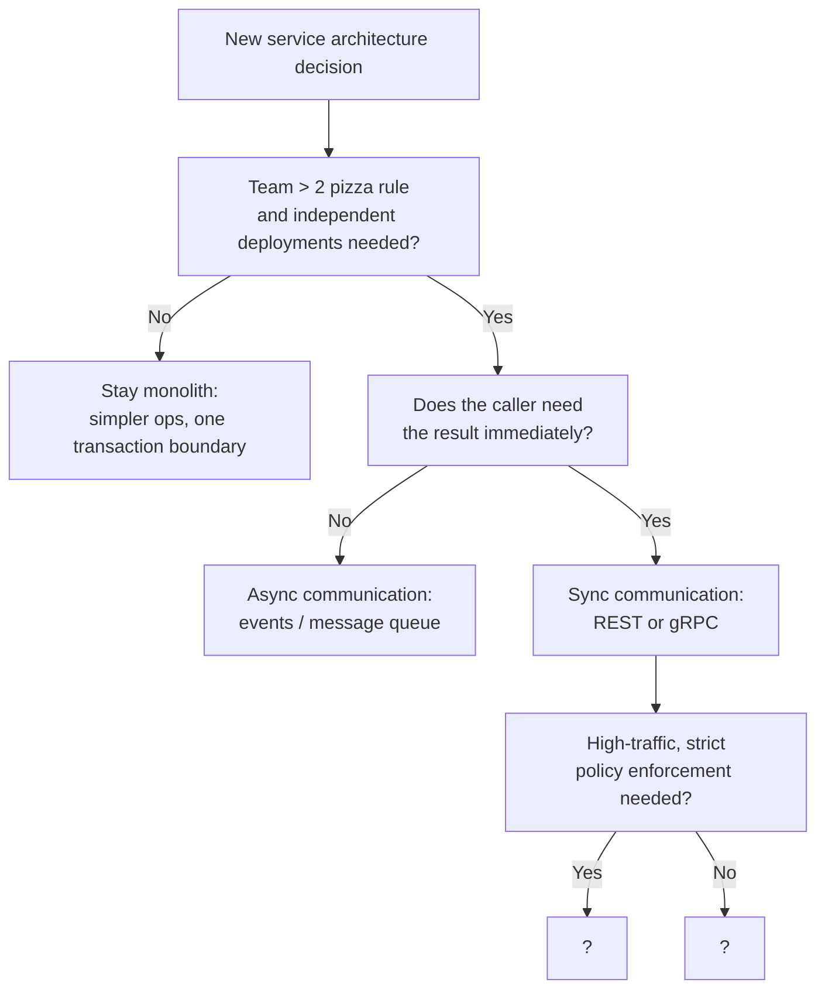

# Microservices Patterns

> Decomposing monoliths into independently deployable services — and managing the complexity that follows

---

## Learning Objectives

By the end of this topic you will be able to:

- Explain what an API Gateway does, including request routing, auth offloading, rate limiting at the edge, and response aggregation, and describe the BFF variant
- Distinguish client-side from server-side service discovery and explain how stale registry entries cause failures
- Describe the sidecar / service mesh architecture, the roles of control plane and data plane, and when the overhead is justified
- Choose between synchronous (REST/gRPC) and asynchronous (events/queues) communication and articulate the dual-write problem
- Apply business capability and bounded-context decomposition strategies and describe the strangler fig pattern for incremental migration
- Make the monolith-vs-microservices decision using team size, deployment independence, and data isolation as driving factors

---

!!! warning "Operational reality"
    Conway's Law cuts both ways: teams tend to build services that mirror their org chart rather than their domain. The operational cost — distributed tracing, independent deployments, N×M service communication matrices, service mesh configuration — frequently exceeds the benefit for organisations under ~100 engineers. "Microservices regret" is documented enough to have spawned the modular monolith movement and the selective-extraction pattern.

    The staff-level answer is knowing *when not to decompose*, not just how. Interviewers at this level expect tradeoff reasoning, not pattern advocacy.

## ELI5: Explain Like I'm 5

<div class="learner-section" markdown>

**Your task:** After working through the patterns, explain the core ideas in plain language.

**Prompts to guide you:**

1. **What problem do microservices solve?**
    - Your answer: <span class="fill-in">Microservices exist because ___, and a monolith struggles when ___</span>

2. **Real-world analogy for an API Gateway:**
    - Example: "An API gateway is like a hotel concierge who..."
    - Your analogy: <span class="fill-in">Think about how a hotel front desk routes every guest request to the right department — you never deal directly with housekeeping or room service...</span>

3. **Why does service discovery exist?**
    - Your answer: <span class="fill-in">Without service discovery, a service would need to ___, which breaks when ___</span>

4. **What is a sidecar in one sentence?**
    - Your answer: <span class="fill-in">A sidecar is a ___ that runs alongside each service so the service itself does not have to ___</span>

5. **When should you NOT split a monolith?**
    - Your answer: <span class="fill-in">You should stay with a monolith when ___ because splitting would ___</span>

</div>

---

## Quick Quiz (Do BEFORE reading further)

!!! tip "How to use this section"
    Write down your predictions now. Return after reading each pattern section to verify.

<div class="learner-section" markdown>

**Your task:** Test your intuition before studying the patterns.

### Architecture Predictions

1. **API Gateway vs direct client-to-service calls:**
    - What does the gateway add? <span class="fill-in">[Your guess]</span>
    - What does the gateway cost? <span class="fill-in">[Your guess]</span>
    - Verified after reading: <span class="fill-in">[Actual trade-offs]</span>

2. **Client-side vs server-side discovery:**
    - Which puts more logic in the client? <span class="fill-in">[Client-side / Server-side]</span>
    - Which is easier to change later? <span class="fill-in">[Your reasoning]</span>
    - Verified: <span class="fill-in">[Fill in]</span>

3. **REST vs gRPC for internal service calls:**
    - When is gRPC preferred? <span class="fill-in">[Your guess]</span>
    - What does gRPC require that REST does not? <span class="fill-in">[Your guess]</span>
    - Verified: <span class="fill-in">[Fill in]</span>

### Scenario Predictions

**Scenario 1:** You are migrating a 300 KLOC monolith to microservices. The payments module is tightly coupled to users, orders, and notifications.

- Where do you start? <span class="fill-in">[Your approach]</span>
- What is the biggest risk? <span class="fill-in">[Your guess]</span>
- Verified after reading Decomposition Strategies: <span class="fill-in">[Fill in]</span>

**Scenario 2:** Service A writes to its own database and then publishes an event to a queue. The write succeeds but the publish fails.

- What state is the system in? <span class="fill-in">[Your guess]</span>
- How do you prevent this? <span class="fill-in">[Your guess]</span>
- Verified after reading Sync vs Async: <span class="fill-in">[Fill in]</span>

**Scenario 3:** A service mesh adds ~1 ms of latency to every service call. Your checkout flow makes 12 sequential service calls.

- Total added latency: <span class="fill-in">[Calculate]</span>
- Is this acceptable? <span class="fill-in">[Your reasoning]</span>
- Verified after reading Sidecar / Service Mesh: <span class="fill-in">[Fill in]</span>

</div>

---

## Pattern 1: API Gateway

An API gateway is a reverse proxy that sits at the entry point of a microservices system. All external client traffic passes through it before reaching any backend service.

### Core responsibilities

**Request routing** — the gateway maps inbound paths and methods to the correct backend service. A call to `GET /orders/123` is forwarded to the Order Service; `POST /payments` goes to the Payment Service. Routing rules can include path rewriting, header-based routing, and version management.

**Auth offloading** — rather than every service implementing JWT validation or API key checks, the gateway handles authentication centrally. It verifies the token once and passes a validated identity header downstream. This removes duplicated security code and ensures consistent enforcement.

**Rate limiting at the edge** — applying rate limits in the gateway protects all downstream services simultaneously. A single throttle policy prevents a misbehaving client from overwhelming any service regardless of which endpoint is called.

**Response aggregation** — the gateway can fan out one client request to multiple services and merge the responses into a single payload. A mobile app loading a profile page needs user data, recent orders, and notifications; the gateway calls all three in parallel and returns one response, saving the client three round trips.

### Backend for Frontend (BFF)

The BFF variant creates a separate gateway instance per client type — one for the web app, one for mobile, one for third-party API consumers. Each BFF is tailored to the data shape and latency requirements of its specific consumer. A mobile BFF can return smaller payloads and do additional caching; a web BFF can handle richer aggregation.

**Trade-offs to know at the interview level:**

| Concern | Detail |
|---------|--------|
| Single point of failure | Every request passes through the gateway; if it goes down, all external traffic stops. Mitigate with redundant instances and circuit breakers. |
| Bottleneck | At very high traffic, the gateway becomes a throughput ceiling. Horizontal scaling helps, but every hop adds latency (~1–2 ms typical). |
| Coupling | Business logic that creeps into the gateway (conditional routing based on order status, for example) creates a deployment coupling between the gateway and domain services. Keep the gateway dumb. |
| Observability anchor | The gateway is the natural place to inject trace IDs, log request/response metadata, and emit per-route metrics. |

---

## Pattern 2: Service Discovery

In a microservices deployment, service instances start and stop dynamically. Kubernetes pods are replaced; auto-scaling adds instances; blue-green deployments swap pools. No static `/etc/hosts` entry can keep up. Service discovery solves this by maintaining a live registry of available instances.

### Client-side discovery (Eureka / Ribbon pattern)

Each service registers itself with a registry on startup and deregisters on shutdown. A calling service (the client) queries the registry directly to get a list of healthy instances, then applies its own load-balancing logic (round-robin, least-connections) to choose one.

```
Client → Registry.lookup("order-service") → [10.0.1.5:8080, 10.0.1.6:8080]
Client → picks 10.0.1.5:8080 → sends request
```

**Pros:** no extra network hop; client controls load-balancing strategy.
**Cons:** every service must embed registry client code; language diversity becomes painful; registry query adds latency.

### Server-side discovery (load balancer queries registry)

The client sends its request to a load balancer (or the API gateway). The load balancer queries the registry and forwards to a healthy instance. The client knows nothing about the registry.

```
Client → LoadBalancer → Registry.lookup("order-service") → 10.0.1.5:8080
LoadBalancer → forwards request → Order Service
```

**Pros:** client code is simple; works across languages; easier to swap discovery mechanisms.
**Cons:** extra network hop; load balancer must be highly available; potential bottleneck.

### Health check registration

Registries are only useful if they reflect reality. Services register with a health-check endpoint (`/health` or `/actuator/health`). The registry polls this endpoint at a configured interval (e.g., every 10 seconds). If the service fails to respond within a threshold, it is marked unhealthy and removed from the pool.

### Stale registry entries

A common failure mode: a service instance dies abruptly (OOM kill, power loss) without deregistering. The registry still lists it as healthy until the next health-check poll fails and propagates. During that window (up to tens of seconds), callers get connections routed to a dead instance. The mitigation is aggressive health-check intervals, short TTLs, and caller-side retry logic with exponential backoff.

---

## Pattern 3: Sidecar / Service Mesh

### The sidecar proxy

A sidecar is a separate process co-deployed with each service instance — typically in the same Kubernetes pod as a second container. The sidecar intercepts all inbound and outbound network traffic for the service. The canonical implementation is Envoy Proxy.

Because the sidecar handles networking, the service itself is relieved of several cross-cutting concerns:

- Mutual TLS (mTLS) between every pair of services
- Circuit breaking and retries
- Distributed tracing header propagation
- Traffic shaping and canary routing

### Control plane vs data plane

A service mesh has two distinct planes:

**Data plane** — the collection of all sidecar proxies. Proxies forward actual traffic. They make per-request decisions based on configuration they receive from the control plane.

**Data plane examples:** Envoy (used by Istio), Linkerd proxy, Consul Connect.

**Control plane** — the management layer that configures all proxies consistently. It distributes routing rules, certificate rotation, and policy without touching the services themselves.

**Control plane examples:** Istio's Istiod, Linkerd's control plane, Consul.

### mTLS injection

Without a mesh, services typically trust the network: if a request arrives on port 8080, it is processed. With mTLS, every service-to-service connection is mutually authenticated using certificates managed by the control plane. A compromised internal service cannot impersonate another service because it lacks a valid certificate. The mesh rotates certificates automatically, typically on a short cycle (hours, not months).

### When the overhead is worth it

The sidecar adds latency (typically 0.5–5 ms per hop depending on configuration) and resource consumption (additional CPU and memory per pod). This overhead is justified when:

- The organisation operates many services across multiple teams and needs consistent policy enforcement without relying on each team to implement it correctly
- Regulatory requirements mandate encrypted east-west traffic (mTLS)
- Observability across service boundaries (distributed traces, per-route latency histograms) is a hard requirement
- Traffic management (canary releases, traffic mirroring, fault injection for chaos testing) is actively used

For a small team operating five to ten services, the operational complexity of running a service mesh typically outweighs the benefits. A simpler approach — shared libraries for retries and tracing, TLS at the load balancer — is often sufficient.

---

## Pattern 4: Sync vs Async Communication

### Synchronous: REST and gRPC

In synchronous communication the caller blocks until the callee responds. The operation is bounded in time (connection timeout + read timeout) and the result is immediately available to the caller.

**REST over HTTP/JSON** is the default choice for synchronous inter-service calls. It is human-readable, easy to debug, and compatible with any language. The trade-off is verbosity and the overhead of JSON serialisation at high throughput.

**gRPC over HTTP/2 with Protocol Buffers** is preferred when:

- Latency is critical (binary serialisation is 5–10x faster than JSON for the same payload)
- Contracts between services need to be strictly enforced (protobuf schema generates typed clients and servers)
- Bidirectional streaming is required (gRPC supports server-streaming, client-streaming, and bidirectional streaming natively)
- Internal service-to-service calls where human-readability is not a concern

**When sync creates tight coupling:**

A chain of synchronous calls — checkout → payment → inventory → notification — means all four services must be available for checkout to succeed. If inventory is slow, checkout is slow. This is temporal coupling: the availability and latency of one service is directly felt by every upstream caller. Sync call chains also amplify failure: a 1% error rate in each of five services cascades to a ~5% checkout failure rate.

### Asynchronous: events and queues

In asynchronous communication the caller publishes a message to a broker (Kafka, SQS, RabbitMQ) and returns immediately. The callee consumes the message at its own pace.

**When to use async:**

- The calling service does not need an immediate response (order confirmation email, inventory reservation)
- The downstream service can tolerate delay (analytics, audit logging, search index updates)
- You want to decouple the availability of two services so that a downstream outage does not block upstream work
- Processing load needs to be smoothed: a spike of 10,000 orders per second can be queued and processed at 1,000 per second by the consumer

**When async does not fit:**

- The caller needs the result synchronously (payment authorisation: the user is waiting for approval)
- Strong consistency is required across services (reserving the last seat on a flight cannot be deferred)
- Debugging complexity is already a concern: async flows are harder to trace and reason about than synchronous chains

\!\!\! tip "When NOT to go event-driven"
    When you adopt async communication broadly across services you are building an event-driven architecture (EDA): services react to events rather than calling each other directly. The appeal is loose coupling. The cost arrives later: no service owns the business process end-to-end, so debugging a failed order requires reconstructing a transaction from events scattered across six Kafka topics. At-least-once delivery means every consumer must be idempotent. Fan-out amplifies unexpectedly — one `OrderPlaced` event triggers inventory, payments, notifications, and analytics consumers, each of which may emit further events. Schema changes to a shared event type require auditing every consumer before deploying.

    EDA makes sense when producers genuinely cannot or should not know their consumers: public event streams, cross-team boundaries, audit pipelines. For workflows owned by a single team or within a bounded context, a synchronous call or job queue is easier to trace, test, and own — and much easier to debug at 3am.

### The dual-write problem

A common bug in async systems: a service writes to its own database and then publishes an event.

```
1. Write order to database  ✓
2. Publish "OrderCreated" to Kafka  ✗  (broker unavailable)
```

The database has the order; the queue does not. Downstream consumers never see the event. This is a dual-write problem — two systems that must stay consistent are updated in two separate operations with no atomicity guarantee.

**Standard solutions:**

- **Transactional outbox pattern** — write the event to an `outbox` table in the same database transaction as the domain write. A separate relay process reads the outbox table and publishes to the broker. The database transaction guarantees the outbox row exists if the domain write succeeds.
- **Change data capture (CDC)** — stream database write-ahead log changes (via Debezium + Kafka Connect) and treat log entries as events. The log write is already atomic with the domain write.

---

## Pattern 5: Decomposition Strategies

### Decompose by business capability

A business capability is something the organisation does — Order Management, Customer Identity, Payment Processing, Inventory, Notifications. Each capability maps to one service boundary. Service boundaries aligned to capabilities are stable: the business capabilities themselves rarely change, even as implementations evolve.

This works best when the domain is well-understood up front and team ownership is clear. The risk is that capability boundaries may not align with data access patterns, leading to chatty cross-service calls.

### Decompose by subdomain (DDD bounded contexts)

Domain-Driven Design introduces the concept of a bounded context: a semantic boundary within which a specific domain model is internally consistent. The word "Order" means something different inside the Fulfilment context (a physical shipment) than inside the Billing context (a financial record). Treating them as the same entity creates a model that serves neither context well.

Bounded-context decomposition acknowledges that different parts of the business have different models for the same real-world thing. Each bounded context becomes a service (or a small cluster of services). Communication across context boundaries uses anti-corruption layers or well-defined events to translate between models.

**Heuristics for service boundaries:**

- A service owns its data: no other service queries its database directly
- A service can be deployed independently without coordinating with other teams
- A service is small enough that a single team can own it end-to-end
- A service does not share a mutable database table with any other service

### Strangler fig pattern

The strangler fig (named after a vine that grows around a tree) is the standard approach for migrating a monolith incrementally without a big-bang rewrite.

**Steps:**

1. Route all traffic through a facade (often the existing API gateway or a new proxy layer) in front of the monolith
2. Identify the first capability to extract — choose one with clear boundaries, low coupling, and high deployment friction in the monolith
3. Build the new microservice alongside the monolith
4. Route the specific traffic for that capability to the new service via the facade
5. Remove the corresponding code from the monolith
6. Repeat for the next capability

At any point in this process, the system is functional: the facade routes to the new service for extracted capabilities and falls back to the monolith for everything else. There is no downtime window. The monolith is incrementally "strangled" until it no longer exists — or until the remaining core is small enough that it becomes acceptable to keep.

**Rollback strategy:** because the facade still routes to the monolith code path for un-migrated capabilities, rolling back a specific service means updating one routing rule in the facade. The monolith code is not deleted until confidence is high.

---

## Implementation

```java
import java.util.List;
import java.util.Optional;

/**
 * ServiceInstance represents a live, healthy instance of a named service.
 */
public class ServiceInstance {

    private final String id;          // Unique instance identifier (e.g. pod name)
    private final String serviceName; // Logical service name (e.g. "order-service")
    private final String host;
    private final int port;

    public ServiceInstance(String id, String serviceName, String host, int port) {
        this.id = id;
        this.serviceName = serviceName;
        this.host = host;
        this.port = port;
    }

    public String getId() { return id; }
    public String getServiceName() { return serviceName; }
    public String getHost() { return host; }
    public int getPort() { return port; }

    public String getAddress() {
        return host + ":" + port;
    }
}

/**
 * ServiceRegistry — the source of truth for available service instances.
 *
 * Implementations might be backed by Consul, Eureka, or Kubernetes endpoints.
 */
public interface ServiceRegistry {

    /**
     * Register a new service instance on startup or after a health-check recovery.
     *
     * TODO: Persist the instance so that lookup() can return it.
     * Consider: what happens if the same id is registered twice?
     */
    void register(ServiceInstance instance);

    /**
     * Deregister a service instance on graceful shutdown.
     *
     * @param instanceId the id field from the ServiceInstance to remove
     *
     * TODO: Remove the instance from the registry.
     * Consider: what if the id does not exist? (idempotent is preferable)
     */
    void deregister(String instanceId);

    /**
     * Return all healthy instances of a named service.
     *
     * @param serviceName the logical service name (e.g. "order-service")
     * @return list of currently registered instances; empty list if none healthy
     *
     * TODO: Filter the registry to instances whose serviceName matches.
     * TODO: Optionally filter by health status if instances carry a health field.
     * Consider: what should callers do when the returned list is empty?
     */
    List<ServiceInstance> lookup(String serviceName);
}

/**
 * HttpRequest is a minimal representation of an inbound HTTP request.
 */
public class HttpRequest {

    private final String method;  // GET, POST, PUT, DELETE, ...
    private final String path;    // e.g. "/orders/123"
    private final String body;

    public HttpRequest(String method, String path, String body) {
        this.method = method;
        this.path = path;
        this.body = body;
    }

    public String getMethod() { return method; }
    public String getPath() { return path; }
    public String getBody() { return body; }
}

/**
 * RoutingRule maps a path prefix to a logical service name.
 *
 * Example: prefix="/orders" → serviceName="order-service"
 */
public class RoutingRule {

    private final String pathPrefix;
    private final String serviceName;

    public RoutingRule(String pathPrefix, String serviceName) {
        this.pathPrefix = pathPrefix;
        this.serviceName = serviceName;
    }

    public String getPathPrefix() { return pathPrefix; }
    public String getServiceName() { return serviceName; }
}

/**
 * ApiGateway — routes inbound requests to the correct backend service instance.
 *
 * Responsibilities implemented here: routing and service discovery.
 * Auth offloading, rate limiting, and response aggregation are left as TODOs.
 */
public class ApiGateway {

    private final ServiceRegistry registry;
    private final List<RoutingRule> routingRules;

    public ApiGateway(ServiceRegistry registry, List<RoutingRule> routingRules) {
        this.registry = registry;
        this.routingRules = routingRules;
    }

    /**
     * Route an inbound HTTP request to a backend service instance.
     *
     * @param request the inbound request from an external client
     * @return the address of the backend instance to forward to,
     *         or empty if no matching rule or no healthy instance exists
     *
     * TODO: Step 1 — Authenticate / authorise the request.
     *   Check a JWT or API key before routing. Reject with 401/403 if invalid.
     *   (In production this would call an auth service or validate locally.)
     *
     * TODO: Step 2 — Apply rate limiting.
     *   Check a per-client counter before forwarding.
     *   Return 429 Too Many Requests if the client is over quota.
     *
     * TODO: Step 3 — Find a matching routing rule.
     *   Iterate routingRules and find the first rule whose pathPrefix
     *   is a prefix of request.getPath().
     *
     * TODO: Step 4 — Look up healthy instances via the registry.
     *   Call registry.lookup(matchedRule.getServiceName()).
     *   If the list is empty, return empty (no healthy instances).
     *
     * TODO: Step 5 — Select an instance (load balancing).
     *   Implement round-robin or random selection over the instance list.
     *
     * TODO: Step 6 — Return the selected instance address.
     *   Return Optional.of(selectedInstance.getAddress()).
     */
    public Optional<String> route(HttpRequest request) {
        // TODO: implement steps above
        return Optional.empty(); // Replace
    }
}
```

---

## Decision Framework

<div class="learner-section" markdown>

**Your task:** After working through the patterns, fill in your reasoning for each decision point.

### 1. Monolith vs Microservices

**When does a monolith outperform microservices?**

- Team size consideration: <span class="fill-in">A monolith is preferable when ___ because distributed coordination costs ___</span>
- Data consistency consideration: <span class="fill-in">Keeping data in one database avoids ___, which microservices must solve via ___</span>
- Operational complexity: <span class="fill-in">A monolith removes the need for ___, which microservices require for each service</span>

**Signals that microservices are warranted:**

- Deployment independence signal: <span class="fill-in">You need microservices when different teams need to deploy ___ because ___</span>
- Scale signal: <span class="fill-in">You need microservices when ___ components need to scale independently of ___</span>
- Team autonomy signal: <span class="fill-in">You need microservices when ___ teams are blocked by ___</span>

### 2. Service Boundary Heuristics

For each heuristic, fill in why it matters and what goes wrong when it is violated:

- **Single team ownership:** <span class="fill-in">A service boundary is correct when ___; it is wrong when ___</span>
- **Own your data:** <span class="fill-in">A service should own its database because ___; sharing a database between services causes ___</span>
- **Independent deployability:** <span class="fill-in">A correct boundary means you can deploy Service A without ___; a bad boundary forces ___</span>

### 3. Sync vs Async Decision

**Choose synchronous (REST/gRPC) when:**

- <span class="fill-in">[Scenario where the caller needs ___]</span>
- <span class="fill-in">[Scenario where consistency requires ___]</span>

**Choose asynchronous (events/queues) when:**

- <span class="fill-in">[Scenario where the caller does not need ___]</span>
- <span class="fill-in">[Scenario where downstream availability should not ___]</span>

**Sync communication creates tight coupling when:**

- <span class="fill-in">A chain of N synchronous calls means ___ because ___</span>
- <span class="fill-in">A 1% error rate in each of 5 services produces ___ end-to-end error rate</span>

### 4. Service Mesh Overhead Justification

Fill in your threshold for when a service mesh is worth the operational cost:

- Justified when: <span class="fill-in">The overhead (~0.5–5 ms per hop, extra CPU/memory per pod) is worth it when ___</span>
- Not justified when: <span class="fill-in">A service mesh adds more cost than value when ___ and a simpler alternative is ___</span>

### 5. Your Decision Tree

Build your decision tree after working through the patterns:



</div>

---

## Practice Scenarios

<div class="learner-section" markdown>

### Scenario 1: E-Commerce Platform Architecture

**Context:** You are the staff engineer responsible for the architecture of a new e-commerce platform. The business capabilities are: product catalogue, customer identity, cart, checkout, payments, inventory, order management, fulfilment, and notifications. The team has 40 engineers split into 6 squads.

**Your design tasks:**

1. **Service decomposition:** Which capabilities become services and which might be grouped together initially?
    - Your answer: <span class="fill-in">[Identify at least 5 service boundaries and explain each grouping decision]</span>

2. **Communication patterns:** For each of these flows, choose sync or async and justify:
    - Customer adds item to cart → cart service updates → inventory service checks availability
        - Pattern: <span class="fill-in">[Sync / Async]</span>
        - Why: <span class="fill-in">[Fill in]</span>
    - Checkout completes → notifications service sends confirmation email
        - Pattern: <span class="fill-in">[Sync / Async]</span>
        - Why: <span class="fill-in">[Fill in]</span>
    - Payment authorisation during checkout
        - Pattern: <span class="fill-in">[Sync / Async]</span>
        - Why: <span class="fill-in">[Fill in]</span>

3. **API Gateway design:** What should the gateway handle vs what should live in each service?
    - Gateway responsibilities: <span class="fill-in">[Fill in: at least 3 concerns]</span>
    - Service responsibilities: <span class="fill-in">[Fill in: what should NOT be in the gateway]</span>

4. **Service discovery approach:** Given a Kubernetes deployment, which discovery model do you use?
    - Your choice: <span class="fill-in">[Client-side / Server-side / Kubernetes native]</span>
    - Reasoning: <span class="fill-in">[Fill in]</span>

**Failure modes:**

- What happens when the API Gateway becomes the single point of failure and goes down during peak Black Friday traffic?
    - Your answer: <span class="fill-in">[Describe the blast radius and at least two mitigations]</span>
- How does your design behave when the inventory service registry entries go stale and checkout routes requests to dead instances for 30 seconds?
    - Your answer: <span class="fill-in">[Describe the user-facing impact and what retry/fallback strategy prevents cascading failure]</span>

### Scenario 2: Migrating Payments from Monolith to Microservices

**Context:** A large fintech company runs a monolith that handles payments, user accounts, transaction history, fraud detection, and reporting. The payments module is tightly coupled: it reads the user table directly, writes to the same transaction table as reporting, and calls the fraud engine synchronously inline. The business requirement is zero downtime during migration and no data loss.

**Your design tasks:**

1. **Strangler fig plan:** Design the step-by-step migration sequence.
    - Step 1 — What do you introduce first? <span class="fill-in">[Facade / gateway / proxy layer — describe its role]</span>
    - Step 2 — Which capability do you extract first and why? <span class="fill-in">[Fill in — which has lowest coupling?]</span>
    - Step 3 — How do you handle the shared transaction table? <span class="fill-in">[Fill in — separate schema, CDC, or dual write?]</span>
    - Step 4 — When do you cut over? <span class="fill-in">[Fill in — what confidence signals trigger the switch?]</span>

2. **Data isolation strategy:** The payments service currently reads `users.credit_limit` directly from the user table.
    - How do you break this dependency? <span class="fill-in">[API call to user service / event-sourced local copy / ___]</span>
    - Trade-off: <span class="fill-in">[Consistency vs availability — what do you lose with each approach?]</span>

3. **Dual-write risk:** During migration, writes must go to both the monolith database and the new payments service database.
    - How do you prevent inconsistency? <span class="fill-in">[Describe transactional outbox or CDC approach]</span>
    - How do you verify the two databases stay in sync? <span class="fill-in">[Fill in — reconciliation job, checksums, ___]</span>

4. **Rollback trigger:** At what point do you roll back to the monolith, and how?
    - Trigger signals: <span class="fill-in">[Error rate threshold / latency SLO breach / ___]</span>
    - Rollback mechanism: <span class="fill-in">[One routing rule change in the facade — describe the specific operation]</span>

**Failure modes:**

- What happens if the new payments microservice is deployed but the facade routing rule is never updated, so 100% of traffic still hits the monolith?
    - Your answer: <span class="fill-in">[Describe the operational/monitoring gap this creates and how you detect it]</span>
- How does your design behave when the fraud detection service (called synchronously during payment) starts timing out at 5 seconds per call, blocking the payment flow entirely?
    - Your answer: <span class="fill-in">[Describe the cascading failure path and whether circuit breaking, async fallback, or a timeout budget resolves it]</span>

</div>

---

## Test Your Understanding

Answer these without referring to your notes.

1. Your API gateway is processing 50,000 requests per second and is deployed as a single instance. An interviewer asks: "What happens when the gateway goes down?" Describe the failure blast radius and give three concrete mitigations, ranked by implementation complexity.

    ??? success "Rubric"
        A complete answer addresses: (1) the blast radius is total external unavailability — no client can reach any backend service because every request passes through the gateway; internal service-to-service traffic is unaffected if it bypasses the gateway, (2) mitigation 1 (low complexity): run multiple gateway instances behind a cloud load balancer with health checks so failures trigger automatic instance replacement, (3) mitigation 2 (medium complexity): deploy the gateway across multiple availability zones so a zone failure does not take all instances offline simultaneously, (4) mitigation 3 (high complexity): implement a fallback that lets critical clients (e.g., mobile apps) call a small set of backend services directly if gateway health checks report unhealthy, accepting reduced feature set; this requires clients to know both the gateway address and fallback addresses.

2. A service registry shows three healthy instances of the cart service. One instance silently died 20 seconds ago but the health-check poll interval is 30 seconds. During those 20 seconds, approximately what fraction of requests to the cart service will fail, and what two mechanisms in the caller can reduce user-visible errors?

    ??? success "Rubric"
        A complete answer addresses: (1) with round-robin distribution across three instances and one dead, approximately 1/3 of calls (33%) will be routed to the dead instance and fail during the stale window, (2) mechanism 1: retry with a fresh instance selection — if the caller catches a connection error and retries once (excluding the failed instance), the success rate recovers to nearly 100% at the cost of one extra hop latency, (3) mechanism 2: client-side circuit breaking (Hystrix / Resilience4j pattern) — after N consecutive failures to a specific instance address, the caller stops routing to it locally without waiting for the registry to update, effectively acting as a fast-path for stale entry detection.

3. A colleague proposes using synchronous gRPC calls from checkout → payment → inventory → notification in a chain. Explain specifically how temporal coupling manifests in this design and propose an alternative communication topology that eliminates it without sacrificing payment correctness.

    ??? success "Rubric"
        A complete answer addresses: (1) temporal coupling: checkout blocks until payment responds, which blocks until inventory responds, which blocks until notification responds; if notification has a 2-second P99 latency, every checkout request waits at least 2 seconds regardless of payment/inventory speed, (2) compounding failure: a 1% error rate in each of four services produces approximately 4% end-to-end error rate (1 - 0.99^4 ≈ 3.9%); a 5-second outage in notification causes 5 seconds of checkout failures, (3) correct alternative: keep checkout → payment synchronous (caller needs authorisation result immediately) and decouple payment → inventory and payment → notification via an event ("PaymentAuthorised" on a Kafka topic); inventory and notification consume independently; checkout completes as soon as payment authorises, and inventory/notification proceed asynchronously without blocking the user.

4. You implement the transactional outbox pattern to solve the dual-write problem. A junior engineer asks: "Why not just write to the database, then publish to Kafka, and catch exceptions?" Explain precisely why exception catching alone does not solve the problem, and describe how the outbox guarantees consistency.

    ??? success "Rubric"
        A complete answer addresses: (1) exception catching fails because the failure modes include the process crashing after the database commit but before the Kafka publish — no exception is thrown in-process; the OS kills the JVM, the network drops, or the Kafka broker is unreachable without timing out before the process exits; (2) additionally, Kafka publish success does not guarantee delivery: "fire and forget" producers can lose messages if the ack setting is insufficient; (3) the outbox guarantees consistency because the event row is written in the same database transaction as the domain row — if the transaction commits, both the domain change and the outbox row are durable together; a separate relay process reads undelivered outbox rows and publishes them, retrying until the broker acknowledges; the relay is idempotent-safe by including an event ID that consumers deduplicate.

5. An engineering manager proposes migrating the monolith using a strangler fig pattern. A senior engineer objects: "If something goes wrong in the new service, how do we roll back without losing data that was written to the new service's database?" Describe a concrete rollback strategy that answers this objection.

    ??? success "Rubric"
        A complete answer addresses: (1) the rollback mechanism is a single routing rule change in the facade — redirect the extracted service's path prefix back to the monolith; this can be executed in seconds without code deployment, (2) the data concern is real: writes that landed in the new service's database after cutover but before rollback are not in the monolith's database; the solution is to run the new service in shadow mode first — receiving traffic, writing to its own database, but the facade still returns the monolith's response; divergence is detectable before full cutover, (3) for the rollback window after full cutover: use CDC or a reconciliation job to stream new-service writes back to the monolith database as a safety net during the confidence-building period; only drop the reconciliation job after the service has been stable for a defined period (e.g., one full business cycle); this ensures rollback never loses writes.

---

## Review Checklist

<div class="learner-section" markdown>

Complete this checklist after studying all five patterns.

- [ ] Can explain what an API gateway does and list four core responsibilities
- [ ] Can describe the BFF pattern and give a concrete example of when a dedicated BFF is justified
- [ ] Can distinguish client-side from server-side service discovery and explain the stale entry failure mode
- [ ] Can describe the sidecar architecture and articulate when a service mesh adds more value than cost
- [ ] Can explain the dual-write problem and describe the transactional outbox pattern as a solution
- [ ] Can choose between synchronous and asynchronous communication for a given scenario and justify the choice
- [ ] Can apply the strangler fig pattern to an incremental migration and describe a concrete rollback strategy
- [ ] Can make the monolith-vs-microservices decision using team size, deployment independence, and data isolation

</div>

---

## Connected Topics

!!! info "Where this topic connects"

    - **[09. Load Balancing](09-load-balancing.md)** — service discovery feeds the load balancer's backend pool; client-side discovery replicates load-balancing logic in each service while server-side discovery centralises it in the load balancer layer → [09. Load Balancing](09-load-balancing.md)
    - **[12. Message Queues](12-message-queues.md)** — async inter-service communication uses message queues as the broker; the dual-write problem and transactional outbox pattern are queue-specific concerns covered in depth there → [12. Message Queues](12-message-queues.md)
    - **[15. Observability](15-observability.md)** — distributed tracing is essential in microservices to follow a request across service boundaries; the service mesh injects trace IDs automatically, and the observability topic covers how to correlate spans across services → [15. Observability](15-observability.md)
