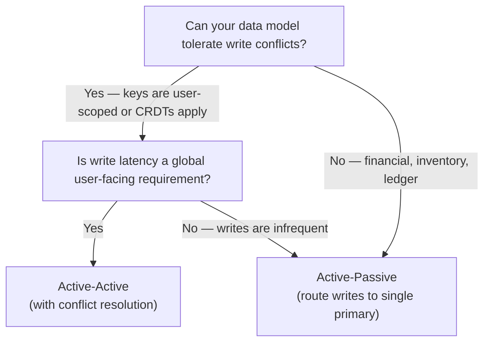

# Multi-Region Architecture

> Spreading data and compute across geographic boundaries to reduce latency, survive regional failures, and satisfy data-residency regulations

---

## Learning Objectives

By the end of this topic you will be able to:

- Distinguish active-active from active-passive deployments and articulate the write-routing and conflict implications of each
- Define RPO and RTO precisely and map them to synchronous versus asynchronous replication choices
- Explain last-write-wins, vector clocks, and CRDTs and identify which is appropriate given conflict frequency and merge semantics
- Describe latency-based routing, anycast, and region affinity and explain how each affects user experience and operational complexity
- Apply partition-by-region patterns to satisfy GDPR data-residency requirements and reason about the cross-region query limitations that result

---

!!! warning "Operational reality"
    Multi-region is a prestige architecture. It signals scale and seriousness, but the majority of systems that adopt it did not need it.

    To understand why, it helps to know what cloud providers actually offer. A single region (e.g. AWS `us-east-1`) is already split into multiple physically separate data centres called Availability Zones (AZs) — `us-east-1a`, `us-east-1b`, `us-east-1c` — each with independent power, cooling, and networking, connected by ~1ms links. Running across multiple AZs within one region protects against a data centre fire, a power failure, a networking fault in one facility. This is **multi-AZ**, and it is largely automatic with managed services (RDS Multi-AZ, ECS across AZs). It achieves 99.99% availability with almost no added complexity.

    **Multi-region** means deploying across geographically separate regions (`us-east-1` + `eu-west-1` + `ap-southeast-1`), hundreds to thousands of miles apart, with 80–200ms latency between them. A full AWS region going down is extremely rare — maybe once every few years, and usually partially. When teams say "we need multi-region for availability," they are usually solving for AZ failures, which multi-AZ already handles.

    The three scenarios that genuinely justify multi-region are: (1) **latency** — serving users globally where a Tokyo user hitting a Virginia server adds 150ms to every request; (2) **data residency** — GDPR and similar regulations requiring that EU user data physically stays in the EU; (3) **extreme availability SLAs** — financial or infrastructure systems where a full regional outage is contractually unacceptable.

    Active-active multi-region is also more common in press releases than in production. Many systems described as "active-active" are actually active-passive with a short failover time. True active-active with conflict resolution is an unsolved problem for most data models: last-write-wins silently loses updates, vector clocks add per-record overhead, and CRDTs fit only specific data structures. Study this topic for the interview scenarios where it is the right answer — not as a default scaling strategy.

## ELI5: Explain Like I'm 5

<div class="learner-section" markdown>

**Your task:** After studying multi-region architecture, explain the core ideas simply.

**Prompts to guide you:**

1. **What problem does multi-region architecture solve?**
    - Your answer: <span class="fill-in">Running your service in one data centre is like ___ — multi-region is like ___</span>

2. **Active-active vs active-passive in one sentence each:**
    - Active-active: <span class="fill-in">Active-active means ___ so that ___</span>
    - Active-passive: <span class="fill-in">Active-passive means ___ so that ___</span>

3. **Real-world analogy for replication lag:**
    - Example: "Replication lag is like a photocopier that..."
    - Your analogy: <span class="fill-in">[Fill in]</span>

4. **Why does conflict resolution matter?**
    - Your answer: <span class="fill-in">When two regions accept writes to the same record simultaneously, ___</span>

5. **What is data sovereignty in plain language?**
    - Your answer: <span class="fill-in">Data sovereignty laws say that ___, which forces architects to ___</span>

</div>

---

## Core Concepts

### Active-Active vs Active-Passive

In an **active-passive** deployment, one region (primary) accepts all reads and writes. One or more passive regions maintain replicas and stand ready to take over. Failover is manual or automated: when the primary becomes unavailable, a passive region is promoted to primary.

Key characteristics of active-passive:

- All writes flow to a single region — no write conflicts by design
- Reads can be served locally from passive replicas if slight staleness is acceptable
- Failover time (RTO) ranges from seconds (automated, pre-warmed) to minutes (cold standbys)
- Users in passive regions pay cross-region latency on writes
- Simpler to reason about: at any moment there is exactly one authoritative copy

In an **active-active** deployment, every region accepts both reads and writes simultaneously. A routing layer directs users to their nearest or lowest-latency region.

Key characteristics of active-active:

- Write latency is local for users everywhere — the primary benefit
- Writes in different regions to the same record can conflict — this is the central challenge
- Replication carries writes between regions; conflicts must be detected and resolved
- Higher throughput: write capacity scales with the number of regions
- No "failover" to trigger — traffic is simply redistributed when a region degrades

The fundamental trade-off is **write latency versus conflict complexity**. Active-active achieves low write latency globally but requires a conflict resolution strategy. Active-passive avoids conflicts entirely but forces non-primary regions to route writes across the globe.

**When to choose active-passive:**

- Writes are infrequent or tolerance for cross-region write latency exists
- Data model cannot express a meaningful merge (e.g., financial ledgers)
- Team capacity to operate conflict resolution is limited
- RPO = 0 is a hard requirement (synchronous replication to one primary is simpler to guarantee)

**When to choose active-active:**

- Write latency is a user-facing requirement in multiple geographies
- Writes are frequent enough that cross-region routing costs are significant
- Workload is naturally partitioned by user (shopping carts, user profiles) — minimising actual conflict rate
- High availability with minimal RTO is paramount

---

### Replication Strategies

Replication moves writes from the region that accepted them to all other regions. The timing of that movement defines the reliability and performance properties of the system.

**Synchronous replication** requires the primary to receive acknowledgement from one or more replicas before returning success to the client.

```
Client → Primary → [write local]
                 → [send to Replica A] ← wait for ACK
                 → [send to Replica B] ← wait for ACK (optional)
         Primary → [return success to client]
```

- RPO: 0 — acknowledged writes are guaranteed to be present on replicas
- Write latency: primary latency + cross-region round trip (often 50–200 ms for intercontinental)
- Throughput: bounded by the slowest replica acknowledgement path
- A replica crash or network partition blocks writes (unless a quorum model is used)

**Asynchronous replication** allows the primary to return success to the client before replicas have acknowledged. Replication proceeds in the background.

```
Client → Primary → [write local]
         Primary → [return success to client immediately]
                 → [send to replicas, best-effort]
```

- RPO: non-zero — unacknowledged lag means recent writes can be lost if the primary crashes
- Write latency: local only — no cross-region wait
- Throughput: not bounded by replica acknowledgement
- Replicas may be seconds or minutes behind depending on load and network conditions

**Semi-synchronous replication** is a common middle ground: require acknowledgement from exactly one replica (often in the same region or an adjacent one) before returning success, and replicate to remaining regions asynchronously. This limits RPO to the lag of the asynchronous replicas while containing the latency impact.

**Replication lag** is the delay between a write being committed on the primary and becoming visible on a replica. It is not a fixed number — it spikes under load, network contention, and schema changes. Applications must reason about lag explicitly:

- A user who writes then immediately reads via a replica may not see their own write
- Read-your-own-writes consistency requires either routing reads to the primary or tracking a replication watermark per session
- Monitoring replication lag as a first-class metric is essential; an unexpectedly growing lag is an early warning of replication pipeline problems

**RPO and RTO definitions:**

| Term | Full name | Meaning |
|------|-----------|---------|
| RPO | Recovery Point Objective | Maximum tolerable data loss measured in time — how old can the most recent surviving write be? |
| RTO | Recovery Time Objective | Maximum tolerable downtime — how long can the service be unavailable after a failure? |

Synchronous replication achieves RPO = 0 at the cost of write latency. Asynchronous replication minimises write latency at the cost of non-zero RPO. Neither choice affects RTO directly — RTO is determined by how quickly failover executes.

---

### Conflict Resolution

A conflict occurs when two regions accept concurrent writes to the same logical record and those writes are incompatible. Conflicts are rare in naturally user-partitioned workloads (each user writes only from their region) but unavoidable in others (global counters, shared documents, inventory).

**Last-Write-Wins (LWW)**

Each write carries a timestamp. When two conflicting versions are reconciled, the one with the later timestamp is retained and the other is discarded.

- Simple to implement; no application logic required
- Requires clock synchronisation across regions — NTP drift or leap-second bugs cause incorrect ordering
- Silently discards writes that arrive slightly out of order — data loss is possible and invisible
- Appropriate for: user profile updates where the user updates from one device at a time, cache values where stale eviction is acceptable

**Vector Clocks**

A vector clock is a map from node ID to logical counter. Each node increments its own entry on every write. Comparing two vector clocks determines causality:

- If `v1[i] <= v2[i]` for all nodes `i`, then `v1` happened-before `v2` (or they are equal)
- If neither vector clock dominates the other, the writes are concurrent and a conflict exists

Vector clocks allow the system to detect conflicts precisely — no false positives. They do not resolve conflicts; they identify them and surface both versions to application code or a merge function.

- Storage overhead: one integer per node per record version
- Appropriate for: shopping carts, collaborative editing — any case where both concurrent writes should be visible or merged rather than dropped

**CRDTs (Conflict-free Replicated Data Types)**

CRDTs are data structures whose merge operation is associative, commutative, and idempotent — meaning any order of merging any subset of updates produces the same result. No coordination is required.

Common examples:

- G-Counter: a per-node count that is merged by taking the max of each node's value
- OR-Set (Observed-Remove Set): supports add and remove operations with well-defined concurrent semantics
- LWW-Element-Set: elements carry timestamps; concurrent add and remove resolves in favour of add or remove consistently

CRDTs eliminate conflict resolution code entirely for supported operations at the cost of restricting the data model. Not all operations can be expressed as CRDTs (arbitrary updates to a balance, for example).

**Application-level merge**

For conflicts that cannot be expressed as a CRDT and where LWW is too lossy, the application implements a merge function. Both conflicting versions are stored (often called siblings), and the next read triggers merge logic.

- Maximum flexibility — can implement domain semantics (e.g., merge shopping carts by union)
- Increases read-path complexity; merge bugs are subtle
- Appropriate for: document stores, rich data models where business rules govern conflict semantics

---

### Geo-Routing

Geo-routing directs each user request to the optimal region. "Optimal" typically means lowest latency, but can also incorporate health, capacity, and compliance constraints.

**Latency-based routing** measures or estimates the network round-trip time between a client's IP address and each region's endpoint. DNS or a global load balancer returns the address of the lowest-latency region. AWS Route 53 latency routing and Google Cloud's global load balancer both operate this way.

- Routing decisions update as latency measurements change
- A degraded region may still receive traffic if it nominally has the lowest latency; health checks must be combined with latency routing

**Anycast** assigns the same IP address to servers in multiple regions. The internet's BGP routing protocol naturally directs packets to the topologically nearest instance of that IP. Cloudflare and many CDNs use anycast for their edge network.

- No DNS TTL delay — routing adjusts at the packet level
- Region selection is transparent to the client; no explicit routing layer needed
- Failure handling depends on BGP convergence time (seconds to minutes)
- Primarily used for stateless services and DDoS scrubbing; less common for stateful databases

**Region affinity** routes all requests from a given user or session to the same region for the duration of a session or longer. This avoids the read-your-own-writes anomaly common in active-active deployments.

- Implemented via sticky cookies, JWT claims encoding a home region, or consistent hashing on user ID
- A user whose home region degrades must be re-routed; their new region may be behind on replication
- Affinity and compliance requirements often align: a European user can be pinned to an EU region both for latency and for GDPR reasons

**Sticky sessions across regions** present an additional complication: session state must either follow the user (replicated) or be regenerated (re-authentication). Stateless session tokens (JWTs) that encode region affinity simplify failover because any region can validate them without a cross-region session lookup.

---

### Data Sovereignty and Compliance

Data sovereignty refers to the principle that data is subject to the laws of the country in which it resides or was collected. For engineering, this primarily manifests as data-residency requirements: certain categories of personal data must be stored on hardware physically located within a specific jurisdiction and must not leave it.

**GDPR (General Data Protection Regulation)** is the primary example. GDPR imposes obligations on any organisation processing the personal data of EU residents, regardless of where the organisation is headquartered. Relevant engineering implications:

- Personal data of EU residents must not be transferred to countries outside the EU/EEA without adequate safeguards (an adequacy decision, Standard Contractual Clauses, or Binding Corporate Rules)
- Data subjects have the right to erasure — deleting a user's data must propagate to all regions where it is stored
- Breach notification obligations require knowing exactly where data lives

**Partition-by-region** is the standard architectural response. User data is assigned to a home region based on the user's jurisdiction at registration. All writes for that user go to their home region; reads from other regions must either query cross-region or cache non-personal data only.

Partition-by-region introduces several engineering challenges:

- **Cross-region queries are expensive or impossible.** Analytics that aggregate over all users must either accept latency (federated query across regions) or replicate anonymised/aggregated data to a global analytics store.
- **User relocation is difficult.** A user who moves from the EU to the US has a home region that no longer reflects their residency. Migrating their data requires a careful hand-off procedure.
- **Operational tooling must be region-aware.** Monitoring dashboards, support tooling, and incident response runbooks must all route to the correct shard.

**Compliance beyond GDPR:** Similar requirements exist in China (PIPL), Russia (Federal Law No. 242-FZ), and India (DPDP Act). A globally deployed service may require a distinct data partition for each major jurisdiction, with explicit controls preventing data from flowing across partition boundaries.

**Pseudonymisation and tokenisation** can reduce the scope of data-residency obligations. If personally identifiable fields are replaced by tokens and the token mapping is stored in the home region, derivative data (event logs, recommendation models) may be eligible to live globally. The legal analysis of whether this satisfies a specific regulation is jurisdiction-dependent.

---

## Implementation

```java
--8<-- "com/study/systems/multiregion/ReplicationManager.java"
```

---

!!! warning "When it breaks"
    Active-active breaks when conflict resolution is non-trivial: concurrent writes to the same record in two regions produce a conflict, and "last write wins" loses data. CRDTs (conflict-free replicated data types) solve this for specific data structures (counters, sets) but not for arbitrary business logic. Active-passive breaks with failover time: DNS TTL-based failover typically takes 30–120 seconds, which is an outage, not transparent failover. Cross-region replication breaks at very low latency requirements: the speed of light between US East and US West is ~70ms round trip, making synchronous replication physically incompatible with sub-100ms write SLOs.

---

## Decision Framework

<div class="learner-section" markdown>

**Your task:** After studying the core concepts, complete these decision guidelines in your own words.

### 1. Active-Active vs Active-Passive

**Choose active-active when:**

- Write volume: <span class="fill-in">[Fill in — what write pattern makes active-active worthwhile?]</span>
- Conflict tolerance: <span class="fill-in">[Fill in — what property of the data model makes conflicts manageable?]</span>
- Cost posture: <span class="fill-in">[Fill in — active-active typically costs more; under what constraint is it justified?]</span>

**Choose active-passive when:**

- Data model: <span class="fill-in">[Fill in — what kinds of records make conflicts unacceptable?]</span>
- RPO requirement: <span class="fill-in">[Fill in — how does a strict RPO favour active-passive?]</span>
- Team constraint: <span class="fill-in">[Fill in — what operational simplification does active-passive offer?]</span>

**Your decision tree:**



After completing the practice scenarios, fill in what you would change about this tree: <span class="fill-in">[Fill in]</span>

### 2. Sync vs Async Replication

Complete the trade-off table after studying Replication Strategies:

| Dimension | Synchronous | Asynchronous |
|-----------|-------------|--------------|
| RPO | <span class="fill-in">[Fill in]</span> | <span class="fill-in">[Fill in]</span> |
| Write latency | <span class="fill-in">[Fill in]</span> | <span class="fill-in">[Fill in]</span> |
| Throughput ceiling | <span class="fill-in">[Fill in]</span> | <span class="fill-in">[Fill in]</span> |
| Failure blast radius | <span class="fill-in">[Fill in]</span> | <span class="fill-in">[Fill in]</span> |

**When RPO = 0 is a hard requirement:** <span class="fill-in">[Fill in — what replication mode is forced, and what latency cost must you accept?]</span>

**When throughput is the constraint:** <span class="fill-in">[Fill in — why does synchronous replication create a throughput ceiling and how does async remove it?]</span>

### 3. Conflict Resolution Strategy Selection

**Use LWW when:**

- <span class="fill-in">[Fill in — what data properties make silent discard acceptable?]</span>

**Use vector clocks when:**

- <span class="fill-in">[Fill in — when do you need to detect conflicts rather than silently resolve them?]</span>

**Use CRDTs when:**

- <span class="fill-in">[Fill in — what operation semantics admit a CRDT formulation?]</span>

**Use application-level merge when:**

- <span class="fill-in">[Fill in — when do business rules govern which concurrent write wins?]</span>

### 4. When Data Sovereignty Forces Partition-by-Region

**You must partition by region when:**

- <span class="fill-in">[Fill in — what regulatory trigger forces physical data separation?]</span>

**The cross-region query trade-off:**

- <span class="fill-in">[Fill in — what analytics or reporting capabilities do you lose with partition-by-region?]</span>
- <span class="fill-in">[Fill in — what is a common mitigation that preserves global analytics without moving personal data?]</span>

</div>

---

## Practice Scenarios

<div class="learner-section" markdown>

### Scenario 1: Globally Distributed Chat Application

**Requirements:**

- Users in the US, EU, and Asia-Pacific send messages in group chats
- Message ordering must be consistent within a channel — all users see messages in the same order
- The service must tolerate a full regional failure without losing messages
- Write latency: users expect messages to appear within 200 ms of sending
- RPO: no message loss after acknowledgement to the sender

**Your design:**

- Active-active or active-passive for message writes? <span class="fill-in">[Fill in]</span>
- How do you achieve consistent ordering across regions? <span class="fill-in">[Fill in — consider sequence numbers, a global sequencer, or causal ordering]</span>
- Replication mode for acknowledged messages? <span class="fill-in">[Fill in — sync or async, and to how many regions?]</span>
- How do you handle a user in the EU sending a message to a US-only group? <span class="fill-in">[Fill in — routing and latency implications]</span>
- What conflict resolution strategy applies to message ordering? <span class="fill-in">[Fill in]</span>

**Failure modes:**

- What happens when the US region loses connectivity mid-conversation? Users in the EU and Asia-Pacific continue writing. When connectivity is restored, how do you reconcile the two divergent message histories? <span class="fill-in">[Fill in]</span>
- A global sequencer that assigns message IDs becomes a single point of failure. If it is unavailable for 10 seconds during peak load, what is the user-visible impact and how would you mitigate it? <span class="fill-in">[Fill in]</span>

### Scenario 2: User Profile Service with GDPR Data Residency

**Requirements:**

- 50 million users, roughly 60% EU residents and 40% US residents
- EU user PII (name, email, address) must be stored exclusively on EU infrastructure
- Non-PII attributes (preferences, feature flags) may be stored globally for low-latency reads
- Users have the right to erasure — deletion must complete within 30 days across all systems
- The product team wants a single global API endpoint that returns a full profile for any user

**Your design:**

- Partition strategy: how do you assign a user to a home region? <span class="fill-in">[Fill in — registration-time signal, explicit flag, or inferred from IP?]</span>
- How does the global API resolve a request for an EU user's profile arriving at the US edge? <span class="fill-in">[Fill in — proxy, redirect, or cached non-PII?]</span>
- How do you separate PII from non-PII in the data model to minimise cross-region calls? <span class="fill-in">[Fill in]</span>
- How do you implement the right to erasure across all regions, including async replication queues and backup snapshots? <span class="fill-in">[Fill in]</span>
- What happens if a user moves from the EU to the US and requests that their data be moved to the US region? <span class="fill-in">[Fill in — migration procedure and compliance implications]</span>

**Failure modes:**

- An EU user's profile write is acknowledged but the async replication to the EU analytics pipeline fails silently. The next erasure request therefore does not propagate to that pipeline. What monitoring and operational procedure prevents this gap? <span class="fill-in">[Fill in]</span>
- A misconfigured CDN edge node caches full EU user PII in a US point-of-presence for 24 hours. What controls at the API layer would have prevented this? <span class="fill-in">[Fill in]</span>

</div>

---

## Test Your Understanding

Answer these without referring to your notes.

1. A payment service uses asynchronous replication with an average lag of 150 ms. The primary region loses power. The RPO is configured as "5 seconds." Is this RPO satisfied? Explain what data is at risk and how you would reduce the RPO without switching entirely to synchronous replication.

    ??? success "Rubric"
        A complete answer addresses: (1) RPO of 5 seconds means up to 5 seconds of writes can be lost on primary failure — 150 ms average lag is well within that budget under normal conditions, but lag spikes under load can violate it; (2) the specific data at risk is every write acknowledged by the primary but not yet replicated at the moment of failure — a 150 ms window on average but potentially larger; (3) a semi-synchronous approach (require acknowledgement from one synchronous replica in the same region, replicate to others async) limits RPO to the sync replica's guaranteed lag while keeping cross-region writes asynchronous and fast.

2. Two regions concurrently update `cart:user-99` — the US adds `item:A` and the EU adds `item:B`. Explain how vector clocks detect this as a conflict rather than as a causal sequence, and describe what a shopping-cart merge function should do with the two versions.

    ??? success "Rubric"
        A complete answer addresses: (1) before the concurrent writes, both regions hold the same clock, e.g. `{us: 1, eu: 1}`; the US write produces `{us: 2, eu: 1}` and the EU write produces `{us: 1, eu: 2}` — neither dominates the other so they are declared concurrent; (2) when the US replicates to the EU, `{us: 2, eu: 1}` and `{us: 1, eu: 2}` are compared — `happensBefore` returns false in both directions; (3) the shopping-cart merge should union the item sets (add both `item:A` and `item:B`), which is the correct domain semantics — discarding either item would be a data-loss bug; OR-Set CRDT encodes this merge automatically.

3. Describe two real-world failure modes of Last-Write-Wins conflict resolution. For each, state the type of system where it is an acceptable trade-off and where it would be dangerous.

    ??? success "Rubric"
        A complete answer addresses: (1) clock skew — if two servers' clocks differ by 200 ms, a causally later write with a slightly earlier wall-clock timestamp is discarded; this is acceptable for cache values where approximate freshness suffices, dangerous for user account settings or financial records; (2) concurrent write loss — two clients update the same field within the same millisecond (or within NTP resolution); the write with the marginally smaller timestamp is silently dropped; acceptable for social-media "like" counts where approximate accuracy is fine, dangerous for inventory counters or seat-reservation systems where each write represents a real-world commitment.

4. A service architect proposes active-active across three regions for a global bank's account balance service. Identify the specific conflict resolution challenge that makes this dangerous and propose an alternative architecture that achieves low write latency globally without risking double-spend.

    ??? success "Rubric"
        A complete answer addresses: (1) the core problem — two regions can each approve a debit simultaneously, spending the same funds twice before replication synchronises; LWW discards one write silently (dangerous), vector clocks detect the conflict but there is no safe merge for conflicting balance updates; (2) CRDTs do not model arbitrary balance updates (a balance can go negative under CRDT semantics); (3) a workable alternative is active-passive with the primary owning the account balance, combined with local read replicas for balance queries — users accept cross-region write latency for debits but see low-latency balance reads; or use a per-user partition where each user's account is owned by exactly one region, routing all writes for that account to its home region.

5. A US user enrolled in your service 3 years ago. The service expands to the EU and must comply with GDPR for all EU residents. The user relocates to Germany. They request that their data be governed under GDPR. Describe the data migration procedure and the two hardest engineering problems you must solve.

    ??? success "Rubric"
        A complete answer addresses: (1) the migration must copy all PII to EU infrastructure, verify completeness, then delete the US copy — a dual-write window during migration risks inconsistency and must be kept short; (2) hard problem one — identifying the complete data footprint: the user's records may exist in the primary database, async replication queues, event logs, analytics warehouses, and backup snapshots; each must be inventoried and migrated or scrubbed; (3) hard problem two — atomic home-region reassignment: during migration, writes must not split between US and EU; a migration lock or a routing change that atomically flips the user's home region must be implemented without causing a visible outage or write loss.

---

## Review Checklist

<div class="learner-section" markdown>

Complete this checklist after implementing and studying multi-region architecture.

- [ ] Can define RPO and RTO precisely and map each to a replication mode
- [ ] Can explain why active-active requires conflict resolution and active-passive does not
- [ ] Can trace a vector clock comparison and correctly identify happened-before vs concurrent writes
- [ ] Can describe at least two failure modes of Last-Write-Wins and state when each is acceptable
- [ ] Can design a partition-by-region data model for a GDPR-constrained service
- [ ] Can articulate the cross-region query trade-off introduced by partition-by-region and name one mitigation

</div>

---

## Connected Topics

!!! info "Where this topic connects"

    - **[11. Database Scaling](11-database-scaling.md)** — read replicas, write sharding, and replication lag management are the foundational database mechanics that multi-region deployments extend to geographic scale → [11. Database Scaling](11-database-scaling.md)
    - **[18. Consensus Patterns](18-consensus-patterns.md)** — leader election across regions is the hardest part of active-active; Raft and Paxos underpin the coordination layer that decides which region is authoritative when network partitions occur → [18. Consensus Patterns](18-consensus-patterns.md)
    - **[03. Networking Fundamentals](03-networking-fundamentals.md)** — geo-routing and replication lag are direct consequences of physical network topology; understanding BGP, anycast, and intercontinental RTT is necessary to reason about feasible RPO targets → [03. Networking Fundamentals](03-networking-fundamentals.md)
